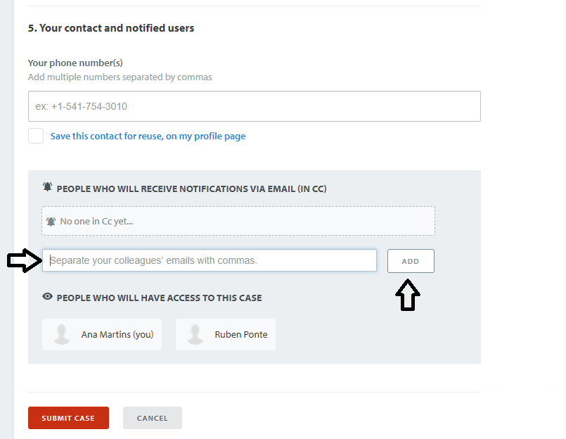
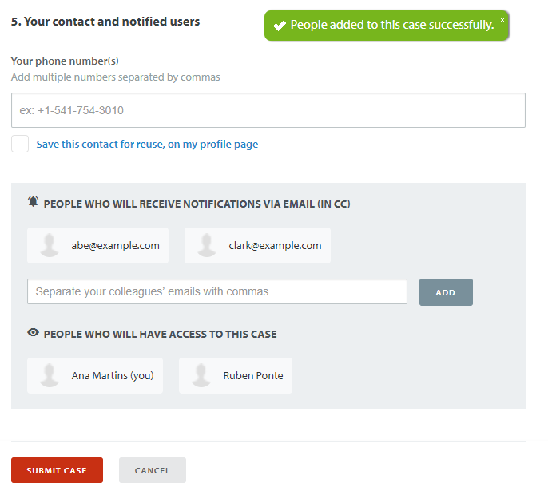
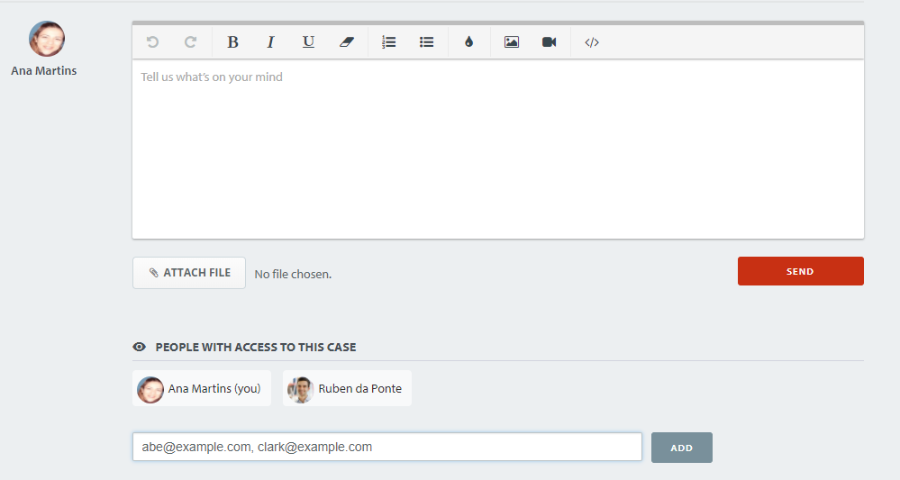
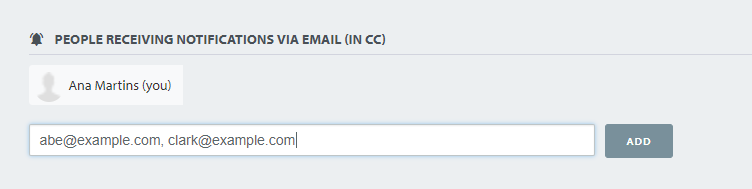

---
summary:
tags:
locale: en-us
guid: 106363F9-E2BA-436E-9CD7-F81BE980BECD
---

# Adding followers to a Support case

On the course of a case, you may wish to include other intervenients to allow them to add further information.
This article explains how to do it when opening and also in an existing case.

This is important because comments added via email by intervenients that weren't formerly part of the case aren't visible to protect the information shared through the support case.

If you have colleagues that you feel should always be involved in your company's support cases, the best solution is to [add them as a member](https://success.outsystems.com/Support/Enterprise_Customers/OutSystems_Support/Managing_your_company_permissions_on_OutSystems_Customer_Portal#How_to_add_a_new_member) of your company.

## How to include case followers 

### When opening a case

In [Support Portal](https://www.outsystems.com/SPP_Ticket_UI/open-support-case), after filling in all the required information about your case, you have to opportunity to include your colleagues beforehand.

After you add a member, the complete list of followers of the case will be visible under **People who will receive notifications via email**.

 
 
### On an existing case

1. Navigate to [your open cases](https://www.outsystems.com/SupportPortal/Support/) and open the case you wish to add followers.

    

1. Type the email(s) separated by commas and click add. From then on, the followers will be allowed to contribute to the case.

    

