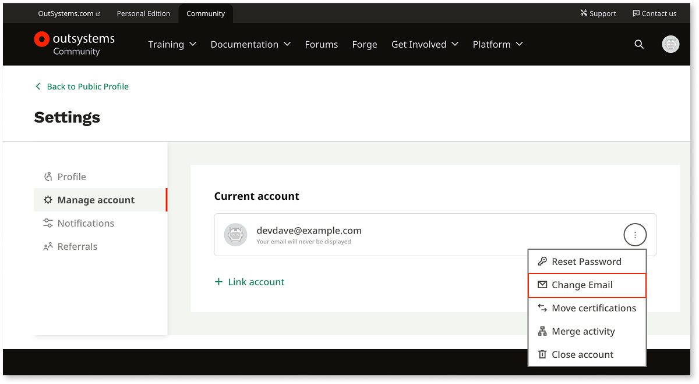
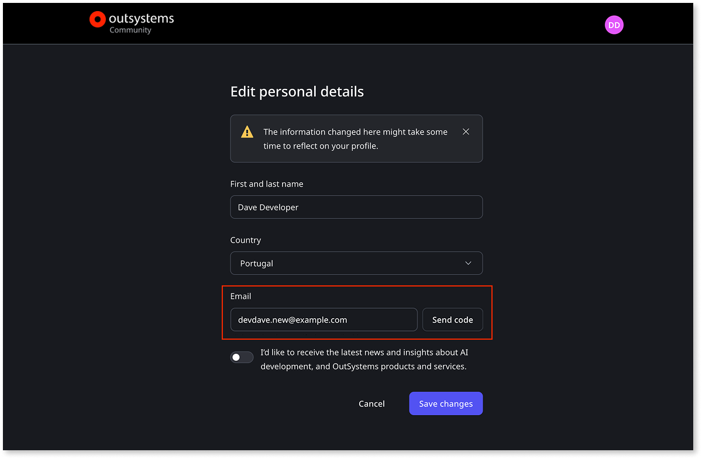
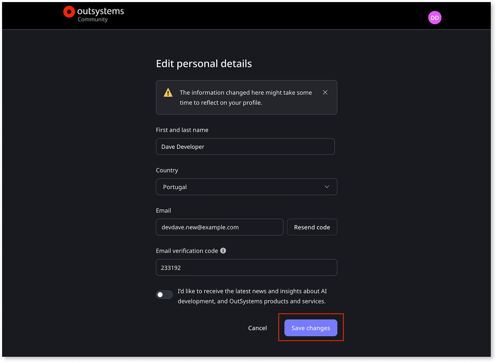

# How to change your OutSystems community email

Your OutSystems community account is the single login for the OutSystems Community, [ODC Personal Edition](https://www.outsystems.com/personaledition/), and [O11 Personal Environment](https://www.outsystems.com/Portal/Trial_Portal). When you change your community account email, it changes for all three.

To change your email, follow these steps:

1. Log in to the OutSystems website with your community account.

    **Note:** If you forgot your password, select [Forgot password?](https://www.outsystems.com/home/RequestPassword.aspx) on the login page.

1. In your profile menu, select **Settings**.

    

1. Select the **More options** icon, then select **Change Email**.

    

1. Type your new email and select **Send code**, then check your current email for the verification code.

    

1. Enter the verification code, then select **Save changes**.

    

    **Note:** It takes some time for the new email to appear on your profile.

The next time you log in, use your new email.
