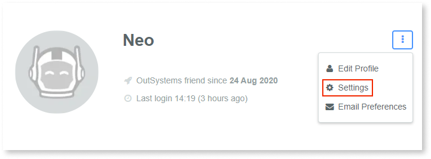

# How to change your OutSystems community email

Your OutSystems community account is the one you use to login at our website. These credentials are also the same you use in Service Studio to connect to your [Personal Environment](https://www.outsystems.com/Portal/Trial_Portal).

1. To change your community account email, you need to be logged in.
1. Access your profile details in **View my profile**.

    

1. Access the **Settings** area.

    

1. Click **Change email** and fill in the form.
1. You'll receive an email to confirm the email change on your new email. 

Your email will be synced to your Personal Environment, the next time you login use the new email as the username.
