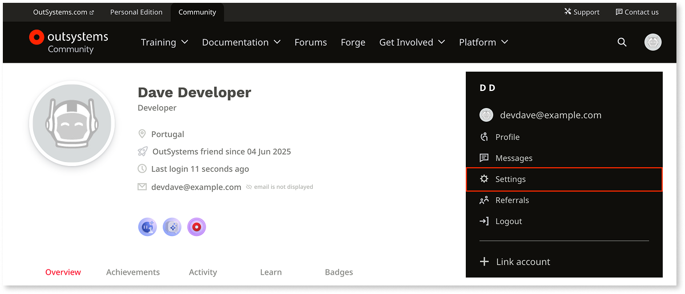
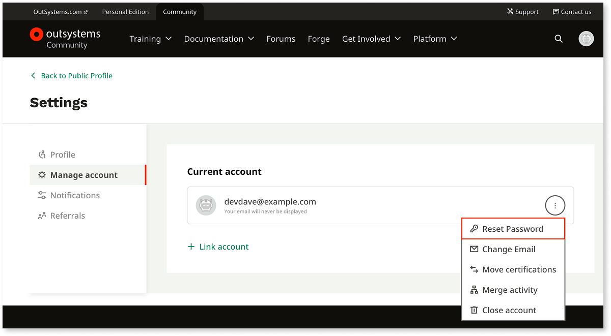
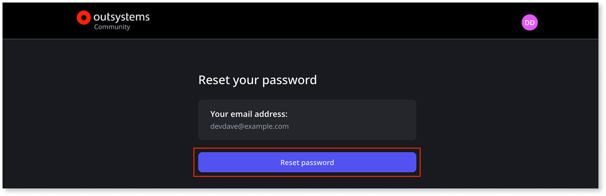
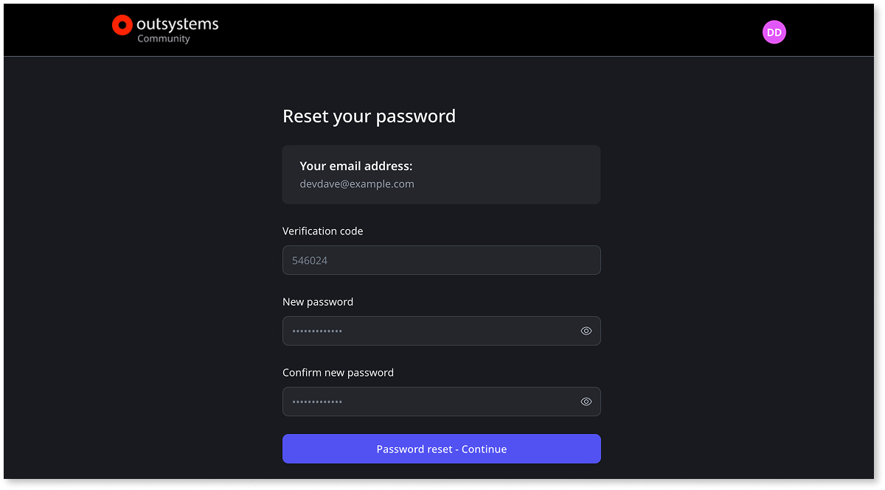

# How to change your OutSystems community password

Your OutSystems community account is the single login for the OutSystems Community, [ODC Personal Edition](https://www.outsystems.com/personaledition/), and [O11 Personal Environment](https://www.outsystems.com/Portal/Trial_Portal). When you change your community account password, it changes for all three.

To change your password, follow these steps:

1. Log in to the OutSystems website with your community account.

    **Note:** If you forgot your password, select [Forgot password?](https://www.outsystems.com/home/RequestPassword.aspx) on the login page.

1. In your profile menu, select **Settings**.

    

1. Select the **More options** icon, then select **Reset Password**.

    

1. Select **Reset password**, then check your email for the verification code.

    

1. Enter the verification code and your new password, then select **Password reset - Continue**.

    

The next time you log in, use your new password.
