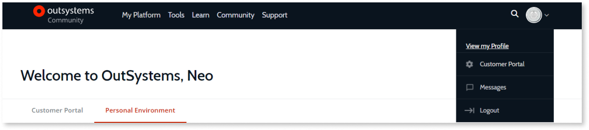
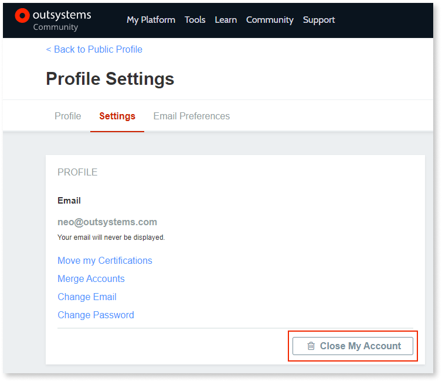

# How to close your OutSystems community account

Your OutSystems community account is the one you use to login at our website. We're sad to see you go, but you always have the option of closing your community account.

This is a destructive operation. You’ll lose your OutSystems rating, private messages and your Personal Environment will be deleted.

1. To close your community account, you need to be logged in.
1. Access your profile details in **View my profile**.

    

1. Access the **Settings** area.

    

1.  Click **Close my account**.

    

1. Type in your password and confirm at **Close my account**.
