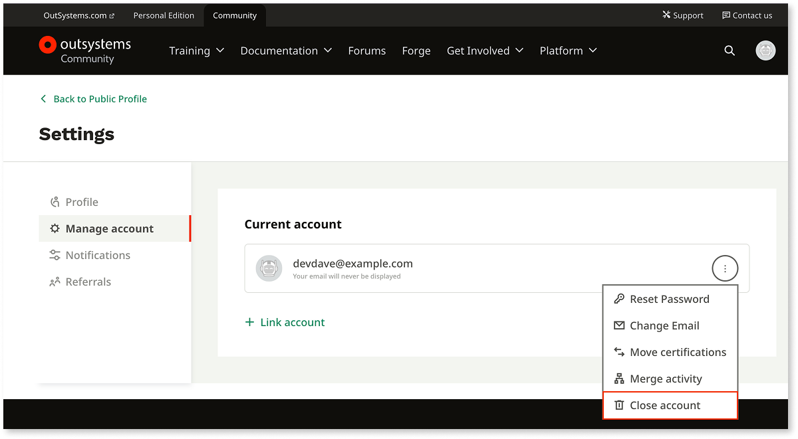
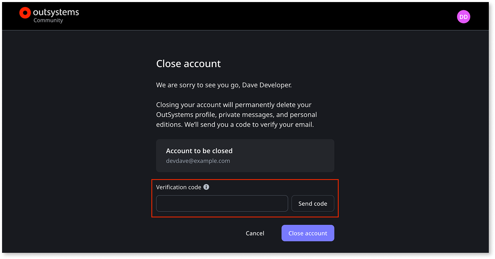
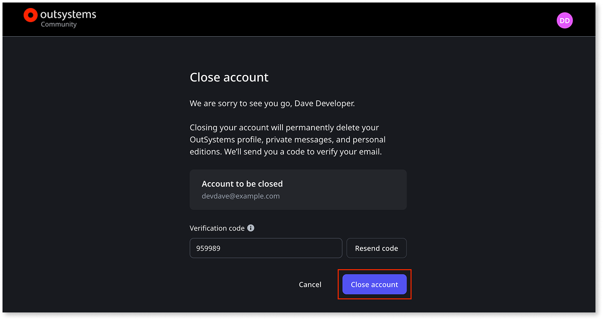
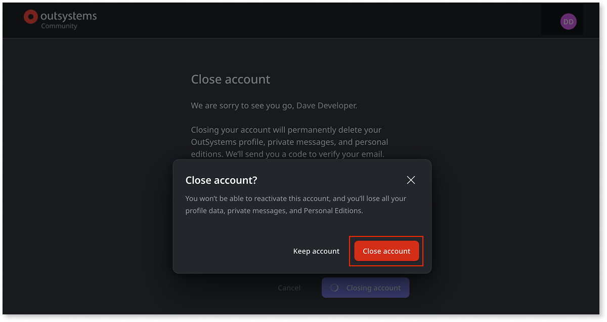

# How to close your OutSystems community account

Your OutSystems community account is the single login for the OutSystems Community, [ODC Personal Edition](https://www.outsystems.com/personaledition/), and [O11 Personal Environment](https://www.outsystems.com/Portal/Trial_Portal). You can close it at any time.

Closing your account is permanent. You lose all your profile data, private messages, Personal Edition, and Personal Environment.

To close your account, follow these steps:

1. Log in to the OutSystems website with your community account.

    **Note:** If you forgot your password, select [Forgot password?](https://www.outsystems.com/home/RequestPassword.aspx) on the login page.

1. In your profile menu, select **Settings**.

    

1. Select the **More options** icon, then select **Close account**.

    

1. Select **Send code**, then check your email for the verification code.

    

1. Enter the verification code, then select **Close account**.

    

1. In the confirmation dialog, select **Close account**.

    

    You can't reactivate your account after you close it. You're logged out, and you receive an email confirming that your account is closed.
