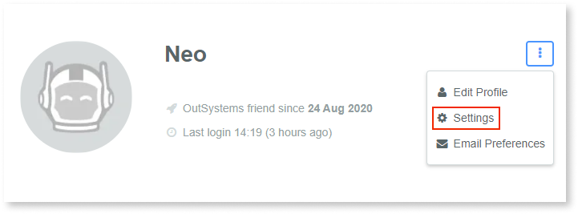

# Merging two OutSystems community accounts

OutSystems community accounts are created using your email. 

Sometimes, it may happen that you have two community accounts created with distinct emails. For example, one with your personal email and another with your work email. You can, if you choose to, merge two accounts into one.
When merging two accounts, the account you wish to keep will receive all the information and the account that will be merged is deleted.

For the purposes of this article:

* **Account A** is the account you wish to keep and that will receive all the information.
* **Account B** is the account that will be merged into account A and deleted. You'll be able to create another account with the email used in this account, but the Personal Environment and account information won't be recovered.

Although most of your community information will be merged into **account A**, this operation will destroy the Personal Environment of **account B**.

It's not possible to revert an account merge.

If you need to transfer your certifications while keeping both accounts active, check [this article](./training/transfer-certification.md) instead.

Do the following to merge two accounts:

1. Login with **account A**.
1. Access the **Settings** area.

    

1. Click **Merge Accounts**.
1. On the form, enter the email address and password of **account B**. This lets us know you own the account.
1. You'll receive an email to confirm the merge.

## What information will be transferred?

The following will be transferred from **account B** into **account A**. The result will be a combination of both the information from account A and B merged in account A.

* Community forums posts and votes on those posts
* Forge components ownership, votes and subscriptions
* Online courses progression
* Certifications and bootcamps
* Ideas, comments and likes on ideas
* Accomplishments (Overview tab on your profile) and Achievements
* Private messages

The profile creation date will be the oldest date. That can be either the creation date of account A or account B. The sames applies to the dates of the badges: Welcome, Profile Superstar, First Idea, First Component, First Post, and MVP

## What information won’t be transferred?

For security reasons, it won’t be possible to keep your Customer Portal or Partner Center permissions. You should ask the administrators to add you afther the merge.

Customer Portal and Partner Center have sensitive information about the companies, and we want to make sure that only authorized people can access.
