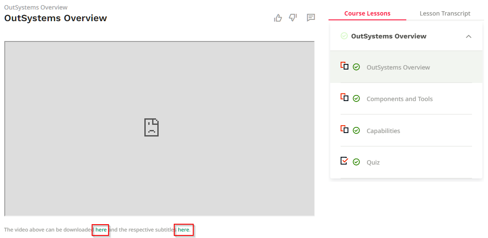

---
summary:
tags:
locale: en-us
guid: b5211c0e-2a18-413a-b995-d511ac8586eb
app_type: traditional web apps, mobile apps, reactive web apps
platform-version: o11
figma:
---

# Access to Online Training when Vimeo is Blocked

The procedure below should only be used in situations where you cannot access the videos directly on the [Training portal](https://www.outsystems.com/training).

If you are following the procedure below, your progress may not be tracked accurately.

You should follow the instructions on the website for other types of content, such as quizzes and exercises.

## Accessing Videos

If the video platform, such as Vimeo is blocked for a video lesson, you can download a copy of the video and watch it. Note that this feature may not be available for all videos. Contact OutSystems support if you need help.

Below the video, you have two links, one to download the video (i.e. .mp4), and a second one to download the subtitles (i.e. .srt).

1. Right-click the first link, and select **Save link as**. Select a location/folder on your computer.

1. Repeat the same step for the second link.

1. Ensure that both the video file (first link) and the subtitles file (second link) have the same name, and a different extension (e.g. .mp4/.srt).

1. We recommend using [VLC media player](https://www.videolan.org/) to watch the videos.
