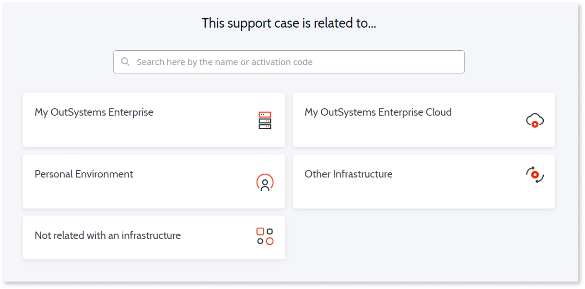

---
summary:
tags:
locale: en-us
guid: A82EA0CB-B101-4F08-BCFB-77559EF63801
app_type: traditional web apps, mobile apps, reactive web apps
---

# Opening a support case with OutSystems

OutSystems makes available a web portal were you can interact with OutSystems support.

For more information about Support terms, [check this article](https://www.outsystems.com/legal/success/support-terms-and-service-level-agreements-sla-of-the-outsystems-software/).

At [Support Portal](https://www.outsystems.com/SPP_Ticket_UI/open-support-case) we designed the best experience to guide you and ensure your case is solved as quickly as possible.

Follows an overview of the most important information about the steps of opening a support case.

## Choose the infrastructure

The first thing we'll need to know is to what infrastructure your case relates to. You'll be shown a list of all the ones you're associated to, including your Personal Environment.

This helps us to route your case to the best team and allows us to make safe assumptions about your infrastructure. Choosing the correct one, is paramount to avoid missunderstandings.

Naturally, there may be cases that aren't related to any infrastructure, so you'll have that option too.

## Select the type of case

Choose the type of case that best applies, depending on the infrastructure you chose you can see diferent options, including:

* **Ask a question**: use this option for inquiries about how to develop, about architecure or for clarification on how a feature works.
* **Report an issue**: choose this type of case when you've encountered bugs, or any issue that implies an interruption of service.
* **Configure the platform**: Most suitable to request one of the [OutSystems Cloud services](https://www.outsystems.com/legal/success/cloud-services-catalog/) available. It can also be used for assistance in configuring your self-managed OutSystems servers or platform.

Support portal, to provide you with a good experience and speed up case resolution, guides you through the necessary information we require.

For example, if you're reporting an issue, we'll ask about it's impact and how can we contact you, if necessary. Or if you're looking to upgrade your OutSystems Cloud, we'll ask you for the upgrade schedulle.
