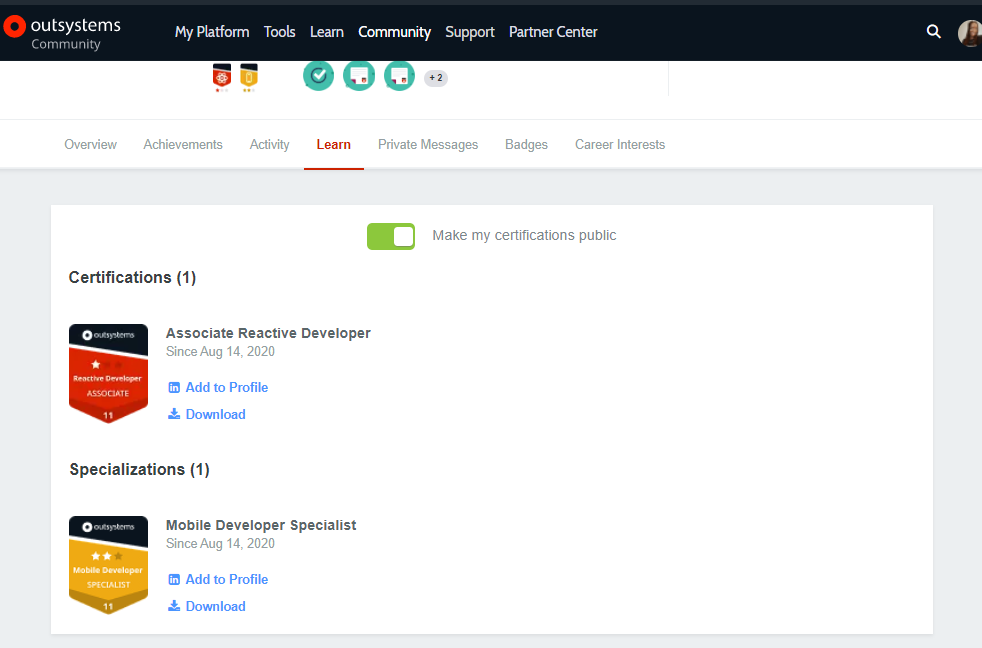

# Learn how to download your certification or specialization badge and certificate

After passing an exam, candidates can find the certification and or specialization badge available on their community profiles, as well as their certificates updates.
The badge and certificate should be available on your community profile a few minutes after  passing the exam:

In case you do not find your certification and/or specialization badges and certificate on your community profile within 24h, please open a [support case for training](https://www.outsystems.com/SPP_Ticket_UI/Question_Deflection), and the Team ensures to make it available for you as soon as possible.
