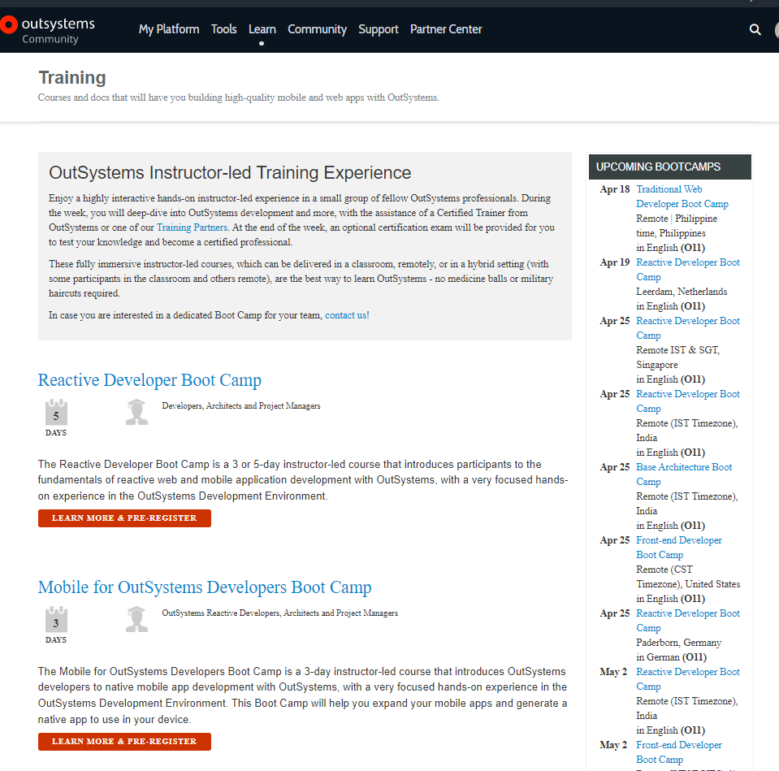

# What is the price of an OutSystems Boot Camp and how can you register

The OutSystems Boot Camps are a great way to learn since participants get to learn in a group, with a trainer on the spot and various hands-on exercises. This is a highly immersive way to learn OutSystems, and it is one of our **training paid offers**.

Users can enroll to participate in any of the Public Boot Camps available on the calendar, checking all of them on our [Boot Camp page](https://www.outsystems.com/training/classroom-training/), selecting according to their type, location (if onsite), or timezone (if remote).

The public boot camps are hosted and delivered by [OutSystems Training Partners](https://www.outsystems.com/partners/training-partners/), these are organizations certified by OutSystems to deliver best-in-class OutSystems Training, our official Boot Camps and Certifications.
To learn details about any Boot Camp you are interested in participating in, you can enroll for it on our [Boot Camp page](https://www.outsystems.com/training/classroom-training/), and not long after you’ll receive the following details:

* Boot Camp price
* Schedule
* Location (onsite or remote)
* Details on what you will learn 
* Request to confirm, or not, your registration to proceed with payment

Whether you wish to participate, or even just learn information about a specific class, the best way to go is to enroll in it, as the Training Partner delivering the class will reply to your registration with these details.

In case you have any further questions about the exam vouchers, please feel free to open a [support case](https://www.outsystems.com/SPP_Ticket_UI/Question_Deflection).
