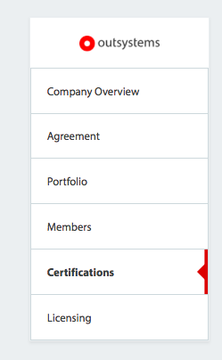
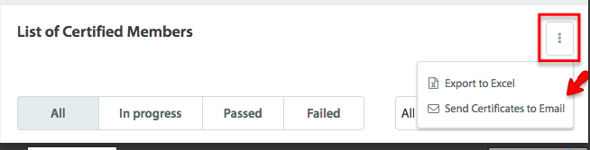

---
summary:
locale: en-us
guid: 5DB16DC0-2CF7-4EDF-813F-4E99EDAD455C
---

# How to download OutSystems certificates of your team

OutSystems certification is an important step in a developer’s career. Because it’s also an assurance of proficiency and skill, we're making it easier for managers to access their employees’ certificates and track their career progress.

 ## You are a customer manager

All managers with **infrastructure administrator** and **company administrator** roles ([read about these roles here](https://success.outsystems.com/Support/Enterprise_Customers/OutSystems_Support/Managing_your_company_permissions_on_OutSystems_Customer_Portal)) can download all their team certificates in the Account Settings tab in the Customer Portal. If you’re a manager with one of these roles, do the following:

You can also monitor the certification progress of everyone on your team and learn whether your developers passed or failed the exam. [Check out this article](https://success.outsystems.com/Support/Account_and_Members_Management/How_many_certified_professionals_do_I_have_on_my_team%3F).

If you don’t see your team in the customer area portal, you might need to invite them ([read how to manage members](https://success.outsystems.com/Support/Enterprise_Customers/OutSystems_Support/Managing_your_company_permissions_on_OutSystems_Customer_Portal)).

## You are a partner manager

You can also monitor the certification progress of everyone on your team and learn whether your developers passed or failed the exam. [Check out this article](https://success.outsystems.com/Support/Account_and_Members_Management/How_many_certified_professionals_do_I_have_on_my_team%3F).

To learn more about the available certifications [visit this page](https://www.outsystems.com/learn/certifications).
