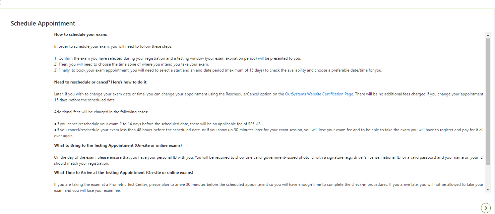

# OutSystems certifications FAQs

During the registration process, as an OutSystems exam candidate, you will be prompted to accept the reschedule and cancelation terms and conditions:

You can also download them directly from OutSystems Certifications page:
This document will lead you through the most common questions related to OutSystems Certifications.

## Scheduling

### Are the slots are in AM or PM?
The time format on the scheduling system is 24 hour. This means that if the slots available are, for example, 04:00 or 04:45, it means these slots are AM. 
If you want to schedule your exam in the afternoon, please make sure the time slots are displayed as 16h00 or 16:45, for example.
The time format on the scheduling system depends on your Google Chrome Language settings (Settings > Advanced > Languages > Languages section > Click on the drop-down arrow). If it is set for English, for example, the time format on the scheduling system will be in AM/PM. If it is set for Portuguese, for instance, the time will follow the 24 hours format.
With this in mind, we advise you to first check your Google Chrome settings before scheduling the exam, this way you will prevent any confusion when selecting the exam time. We also remind you that, as shared in the [User Guide](https://www.prometric.com/sites/default/files/2020-04/PrometricProUserGuide_3.1_1.pdf), it is recommended to use Google Chrome when taking the exam.

### There are no slots available to schedule the exam. What can I do?
When scheduling the exam, be sure to select the 2-week time frame recommended, so you get the maximum number of slots available. You can change the selected start date and choose the best time frame for you, whether it is 1 week or 1 month from the time of scheduling, depending on the availability of slots or the expiration date of the voucher, if they have one.

### What is the confirmation number and how do I have access to it?
The confirmation number, which has 16 numeric characters, is the identification of the exam session you schedule. Once you finish scheduling your exam, you should receive an email with the subject “*Appointment confirmation email*” which includes this information.
If you can’t find it, please check your SPAM folder, since it may be there. In case you still can’t find it, open a Support Case requesting to resend the confirmation email, sharing your name, email, and exam you registered too. The team will give you all the details.

### Can I reschedule exams? Does it have any fees associated?

It's impossible to reschedule the exam less than 48 hours before the exam’s scheduled date. So if you wish, make sure you do it before that.

Yes, you can reschedule exams, as long as it is done up to 15 days before the exam’s original scheduled date and time. Rescheduling an exam 14 days ahead of its date, and up to 48 hours ahead, will incur an extra fee of 25 US$.

### Where can I reschedule or cancel an exam?
Candidates with a scheduled exam can reschedule it by accessing the [Certification Page](https://www.outsystems.com/learn/certifications/), selecting the scheduled exam and clicking the Reschedule or Cancel button, following the steps.

### How can I change my exam appointment from online/test center to test center/online appointment? 

It's impossible to reschedule the exam less than 48 hours before the exam’s scheduled date. So if you wish, make sure you do it before that.

To change your exam appointment to an online/test center, you need to visit this page, cancel the appointment, and register again on the Certification Page, select the option “Remote”/“Certification Center”.

### I can’t reschedule my exam because I’m getting this error message “*Error - We were unable to book your appointment. Please return later to start your appointment selection again*”. What should I do?
If you are getting this message, it means you are trying to reschedule your exam less than 48 hours before the scheduled date of the exam.
According to the reschedule and cancellation policies presented during the scheduling process, you can only reschedule an exam up to 48 hours before the exam scheduled date and time.

### I want to cancel my exam. Can I do it? Will I get a refund? 
You can cancel your exam registration at any time. However, in order to be eligible for a refund, the exam needs to be cancelled up to 15 days before the exam’s original scheduled date and time. 
In case you cancel it within less than 15 days before the exam date, you will not be able to get a refund.

### For rescheduling or canceling reasons, I’m asked for 4 characters of my last name. My Last name only has 3 characters. Can I still reschedule or cancel my exam?
Yes, by default, all candidates will have their user created with their last name with 4 letters, but since this is up to 4, anyone with 2 or 3 characters will be able to use the 3 letters' last name characters and proceed.

## During the Exam

### What is the Eligibility Number? How can I have access to it? 
If you are being requested the Eligibility Number, it means you are trying to register for an exam on Prometric's website. Since this is not the point of entry to register for an OutSystems exam, you should go to the OutSystems the [Certification Page](https://www.outsystems.com/learn/certifications/) instead, to proceed with your registration.

### I was not able to do the exam because I don’t have the ProProctor App installed on my computer. Can I reschedule the exam?
You should receive the ProProctor app information on your “*Appointment Confirmation*” email, either way, you just need to follow the instructions below:
•	[CLICK HERE] (https://www.prometric.com/sites/default/files/2019-10/PrometricProUserGuide.pdf) to review the ProProctor User Guide in preparation for your exam;
•	Carefully read the Remote Proctoring Regulations listed below and adjust your testing environment accordingly.
PRIOR to your exam launch, [CLICK HERE] (https://rpcandidate.prometric.com/) to install the ProProctor Application and perform a System Check.

### What happens if I don’t show up on the exam’s scheduled date and time? 
In case you do not show up for a scheduled exam, it will not be possible for you access to it after that date, since the exam will then become expired. The session will be lost, and there is no possibility to get it rescheduled.

## After the Exam

### I didn’t receive my exam results. What should I do?
After finishing your exam, you should receive in your inbox an email subject “*Exam Type* Certification Exam Report is Available”.
If you can’t find it, please check your SPAM folder, since it may be there. In case you still can’t find it, please visit this page.

### Where can I find my certificate after I pass my exam?
Your certificate is available for you to download on your [Community profile](https://www.outsystems.com/community/) account. Learn how in [this guide](https://success.outsystems.com/support/outsystems_community/training_and_certifications_support/how_to_download_your_outsystems_certificate/).

### Can OutSystems review my exam?
OutSystems does not review any exams. Nonetheless, we make available the exam report you receive with the result, the topics of the questions you failed and we can ensure that exams are correctly assessed and therefore, given scores are accurate and correct.

## Other Questions

### Will the Covid-19 Pandemic affect my exam appointment?
Since Prometric, our service provider, has both the online and Test Center options available, there are also two scenarios. For online exams, candidates should not face any issues and already confirmed appointments will be kept.
For Test Centers, and following government decisions in each country, the Test Center may temporarily close, and in these cases, its appointments will be canceled and rescheduled by Prometric. You can keep up with news regarding the measures taken in [Prometric Response to COVID-19 Outbreak FAQ](https://www.prometric.com/covid-19-update/covid-19-update).
