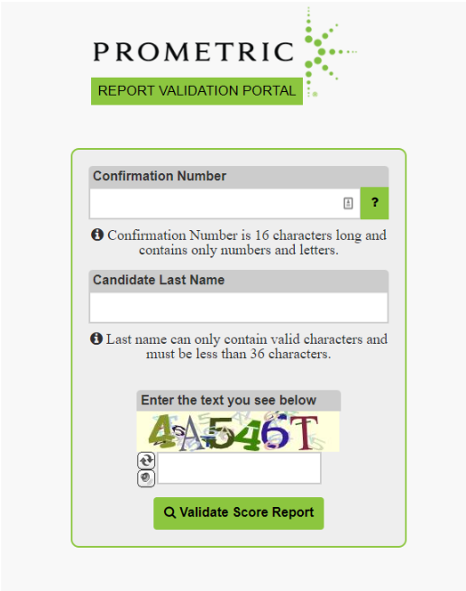

# Did not receive certification or specialization exam score, learn how to access it

When OutSystems exam candidates complete their exams, they receive the exam score report by email, which highlights the result of the exam but also the topics in which the candidate did not get right as well as the ones where they did get right.

In case candidates do not find the score report on your Inbox, SPAM or Junk email folders, candidates can then get access to it by accessing the [Prometric Score Report](https://scorereports.prometric.com/)

Filling in the confirmation number of the exam, as well as the last name, candidates will be available to download their exam score report.

