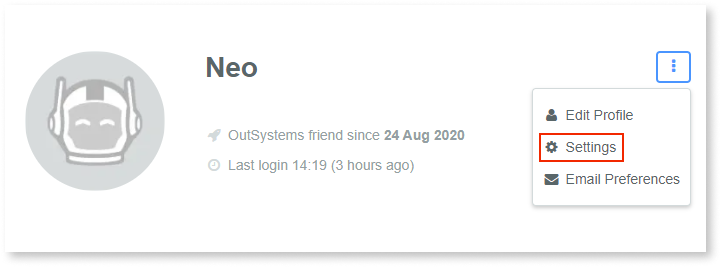

# Transfer your certifications to another account

OutSystems community accounts are created with your email as the username. 

You may happen to have created two community accounts created with diferent emails. For example, one with your personal email and another with your work email.
You can, if you choose to, transfer your OutSystems certifications from one account to the other.

For the purposes of this article:

* **Account A** is the account that will receive the OutSystems certifications.
* **Account B** is the account that has the certifications that will be transferred to account A. After the transfer, this account will no longer have any certifications.

To transfer your certificates to another account do the following:

1. Login with **account A**.
1. Access the **Settings** area.

    

1. Click **Move my certifications**.
1. On the form, enter the email address and password of **account B**. This lets us know you own the account.
1. Confirm by clicking **Migrate**. Your OutSystems certifications were moved into **account A**.
