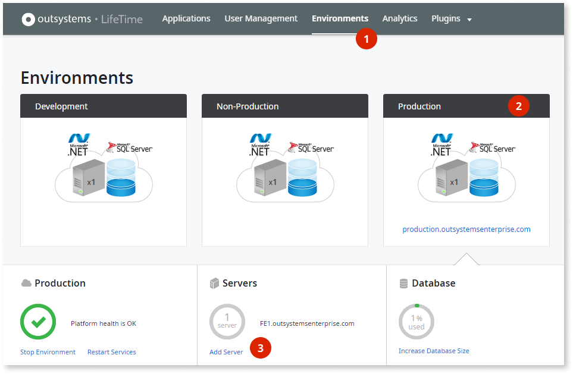

# Add a new front-end server to your environment

We've been working on this article. Please let us know how useful this new version is by voting.

Adding more front-end servers to an environment is a simple process of installation and configuration. Your team can add as many front-end servers as needed for unlimited horizontal scalability. The Platform Server automatically synchronizes applications to the new front-end servers.

## Benefits of this feature

As well as providing [high availability](https://www.outsystems.com/evaluation-guide/how-does-outsystems-provide-horizontal-scalability/#High_availability), scaling horizontally helps to deal with increased:

* User load with more users or more frequent usage
* Business logic complexity or load
* Volume of batch processing
* Data volume or number of transactions

## Add a new front-end server

When adding a new front-end server to your environment, make sure that:

* There are no ongoing deployments or solution publishes.
* There are no prepared deployments to continue, in case you have [two-stage deployments](https://success.outsystems.com/Documentation/11/Managing_the_Applications_Lifecycle/Deploy_Applications/Deploy_in_a_Short_Deployment_Window) enabled in the environment.

Having ongoing or prepared deployments when adding a new front-end server might prevent the correct deployment of the modules.

### On OutSystems Cloud

#### Pre requirements

* This option is available only for production environments.
* You'll need to have the Administrator role assigned in LifeTime.
* The environment can't have custom configurations: some customizations to OutSystems Cloud environments may imply that the **Add Server** link is disabled (on step 3 below). When this happens, you may still request additional front-ends by opening a [support case](https://www.outsystems.com/goto/submit-support-case).

If you're using OutSystems Cloud, login to the LifeTime console and:

1. Go to the **Environments** menu
1. Select your production environment
1. Click the link **Add Server**

    

1. On the next pane, click the **Add Server** button

The new front-end server will be automatically provisioned in the next 90 minutes. You'll receive an email confirmation once it's completed.

We'll contact you if we need more information, or if this implies changes to your subscription.

### On self-managed environments

On the environments you manage, follow a standard server installation:

1. Make sure all the [Installation prerequisites](https://success.outsystems.com/Documentation/11/Setting_Up_OutSystems#Installation_prerequisites) are met.
1. Download the Platform Server installation binaries. Make sure you download the same version that's already running on the other servers of the environment.
1. Follow the installation checklist that's bundled with the Platform Server by:
    * Selecting the **First install** task
    * Choosing the role (the name of the role depends on the Platform Server version):
        * For Platform Server version 11.0.542.0 onwards, choose the **Server** role
        * For all other versions, choose the **Front-end Server** role
    * Select the applicable operating system and database software options

#### Use automation to add new front ends

It's possible to automate horizontal scalability using OutSystems unattended installation commands. The complete instructions can be found at [this document](https://success.outsystems.com/Documentation/11/Setting_Up_OutSystems/Unattended_Installation_and_Upgrade#Adding_a_Front-End).

#### OutSystems on Microsoft Azure

If you're using [OutSystems solution template for Microsoft Azure Marketplace](https://success.outsystems.com/Documentation/11/Setting_Up_OutSystems/OutSystems_on_Microsoft_Azure), you can take advantage of Azure scale sets for horizontal scalability. For complete instructions, check [Using Azure scale sets](https://success.outsystems.com/Documentation/11/Setting_Up_OutSystems/OutSystems_on_Microsoft_Azure/Additional_Configurations_for_OutSystems_on_Microsoft_Azure#Scale_Your_Environments_Using_Azure_Scale_Sets).

