# How to generate a CSR

Sometimes you may need to request a new certificate or renew an existing one and your Certificate Authority (CA) will ask for a Certificate Signing Request (CSR) file in order to issue it. This article describes the options to generate a CSR.

You don’t need to create the CSR in the OutSystems server. You can create it on another computer and keep the .CSR file for later use.

A CSR can be generated in any computer as it contains information identifying the applicant to the domain certificate (and not the server), such as:

* Country
* State
* Organization
* Common name

Domain certificates can be used in the servers of your choice as they are the property of the organisation that holds the private key. As a security best practice, private keys should be treated as confidential information.

These instructions apply to both self-managed and OutSystems Cloud infrastructures and can be executed in any computer or in any of the available tools for the purpose.

## Goal

After completing this how-to you will have two files: one containing a private key, that you should keep in a safe location; and another one containing a CSR request that you should send to your CA.

If you already have an SSL certificate and you wish to install it on your OutSystems environments, check instead:

* [Use your SSL domain in OutSystems Cloud](https://success.outsystems.com/Support/Enterprise_Customers/Installation/Use_your_SSL_domain_in_OutSystems_Cloud)
* [How to install an SSL Certificate in self-managed environments](https://success.outsystems.com/Support/Enterprise_Customers/Installation/How_to_install_an_SSL_Certificate_in_self-managed_environments)

## Steps to generate a CSR

You can generate a CSR in multiple operating systems or tools and can chose the one that best suits you. Examples are:

* [Using IIS](#IIS)
* [Using OpenSSL](#OpenSSL)
* [On a MacOS](#other)
* [On Microsoft Azure Key Vault](#other)

### Using IIS { #IIS }

One of the options to generate a CSR is to use Internet Information Services (IIS). Windows Servers already have IIS enabled by default, but if you are on a Windows computer where IIS is not enabled, you can [enable it in the Control Panel](https://docs.microsoft.com/en-us/dynamics-nav/how-to--install-and-configure-internet-information-services-for-microsoft-dynamics-nav-web-client#install-iis-on-windows-7-8-81-and-10).

You must run all commands as a user with **Administrator** privileges

1. On the Start menu, go to **Windows Administrative Tools** and click on **Internet Information Services (IIS) Manager**.
1. At the left side, click on the server name.
1. At the main window, double-click the **Server Certificates** icon in the **IIS** section in the middle.

    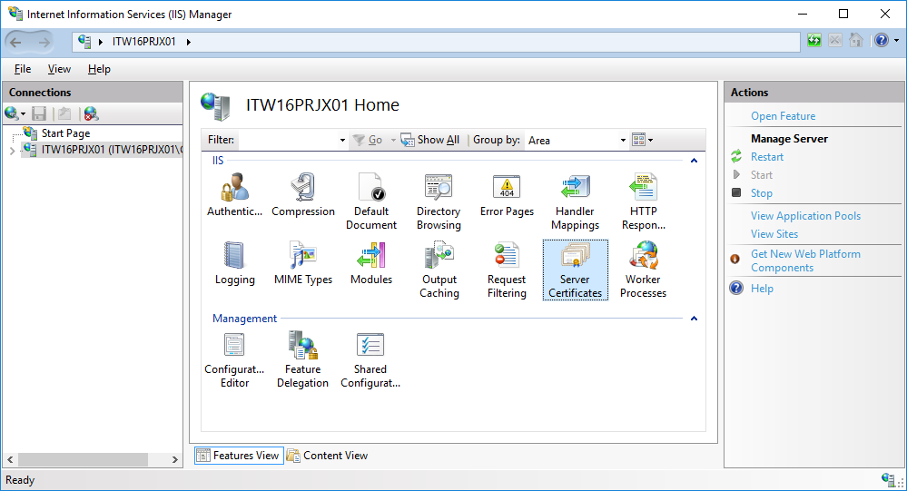

1. At the **Actions** menu on the right side, click on **Create Certificate Request...**

    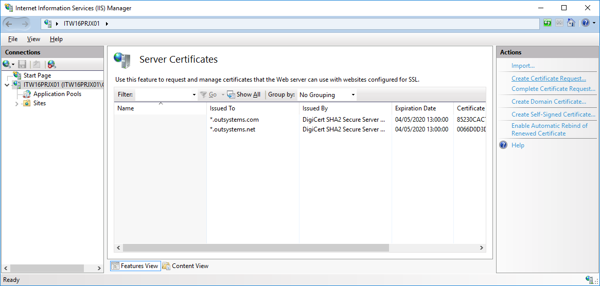

    The Request Certificate Wizard opens.

    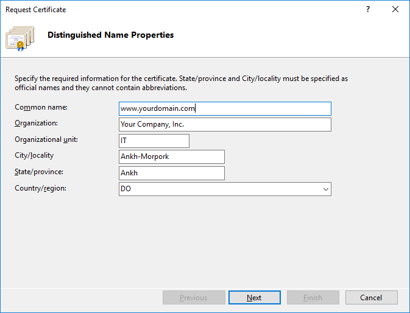

1. Enter the following information at **Distinguished Name Properties**:
    * **Common Name** - The name through which the certificate will be accessed (usually the fully-qualified domain name, e.g., www.domain.com or mail.domain.com).
    * **Organization** - The legally registered name of your organization/company;
    * **Organizational unit** - The name of your department within the organization (frequently this entry is "IT," "Web Security," or left blank).
    * **City/locality** - The city in which your organization is located.
    * **State/province** - The state in which your organization is located.
    * **Country/region** - The country in which your organization is located.

1. Click **Next**.
1. Enter the following information at **Cryptographic Service Provider Properties**:
    * **Cryptographic service provider** - In the drop-down list, select Microsoft RSA SChannel..., unless you have a specific cryptographic provider.
    * **Bit length** - In the drop-down list, select 2048 (or higher).

    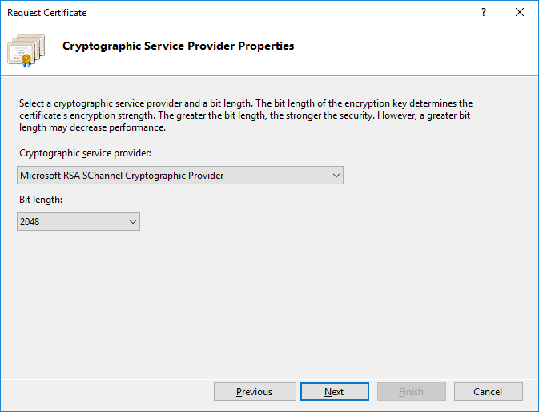

1. Click **Next**.
1. In the **File Name** menu, click the  **...**  button on the right side to browse the location where you want to save the Certificate Signing Request (a text file). If you enter a filename without browsing to a location, your CSR is stored in your computer’s default folder (for example, _Documents_).

    

    Remember the filename you choose and the location where you save it. You will need this file later when ordering a certificate from a Certification Authority.

    

    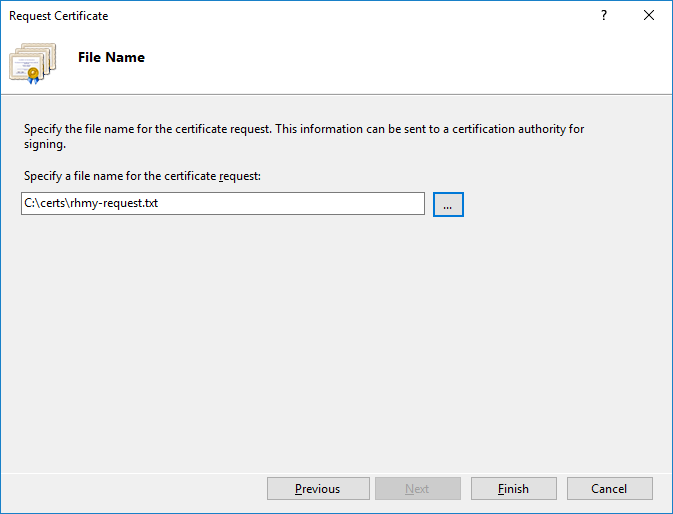

1. Click **Finish**.
1. Your Certificate Signing Request is complete. Keep the generated CSR file safe.

#### Backing up your private key

When you create a Certificate Signing Request, you generate a private key too. Perform the following steps to create a backup of this key:

1. Click the Windows Start button, type **mmc**, and press the **Enter** key to run the Microsoft Management Console.
1. Click **Yes** to allow this app to make changes to your device.

    

    The Microsoft Microsoft Management Console window opens.

    

1. Go to **File** > **Add/Remove Snap-in...**

    

1. Select **Certificates** and click **Add**. The **Certificate snap-in** window opens.

    

1. Select **Computer Account** and click **Next >**.
1. Select **Local Computer** and click **Finish**.

    

1. Click **OK** to close the **add/remove snap-in** window.
1. Expand the **Certificates (Local Computer)** entry on the left side.

     in MMC")

1. Go to **Certificate Enrollment Requests**, expand it, and select the **Certificates** entry.

    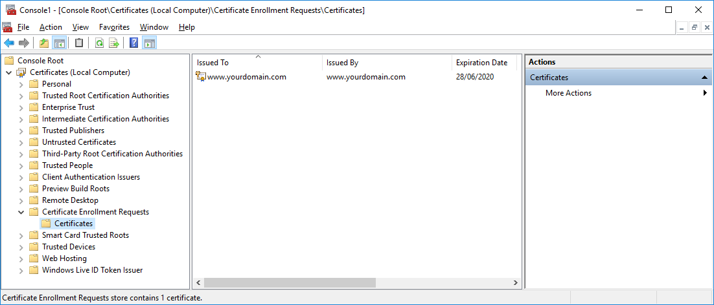

1. At the center, right-click on your certificate and choose **All Tasks > Export**.

    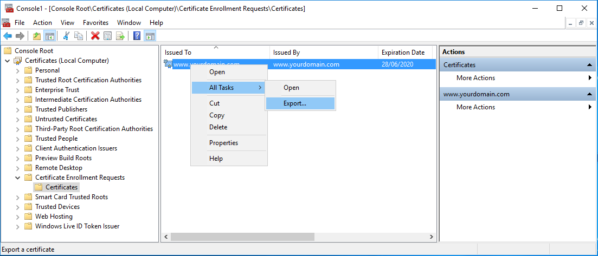

    The Certificate Export Wizard opens.

    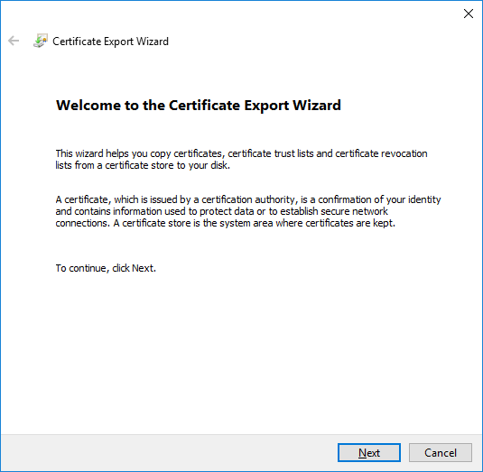

1. Click **Next**.
1. Select the **Yes, export the private key** radio button, and click **Next**.

    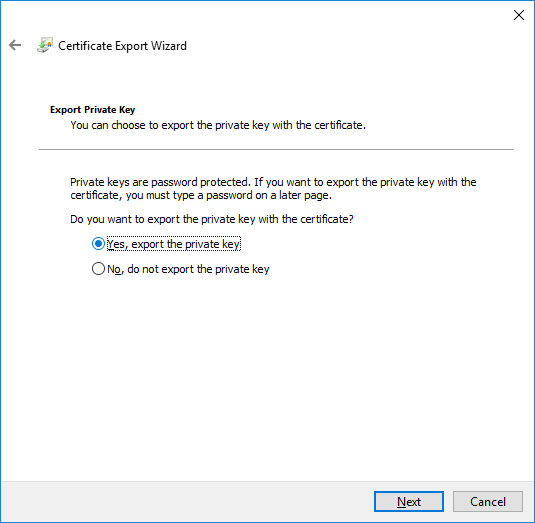

1. Select the **Personal Information Exchange - PKCS #12 (.PFX)** radio button and keep the default selected setting.

    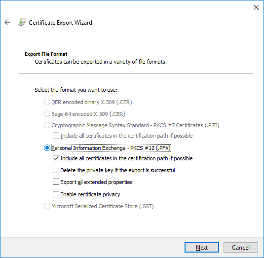

1. Click **Next**.
1. Select the **Password:** checkbox and type a new password for the private key backup file.
1. Re-type your password, and click **Next**.

    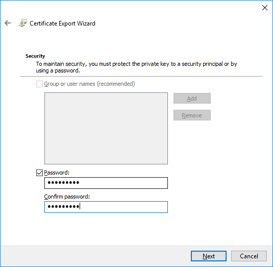

1. Click on the **Browse** button, and browse the location where you want to save the private key Backup file.
1. Type the name for the file. By default, it has a **.pfx** extension.

    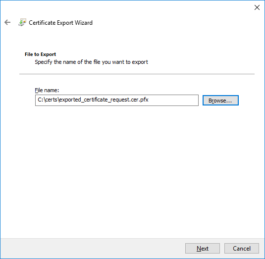

1. Click **Next**. A resume of the operation is shown.

    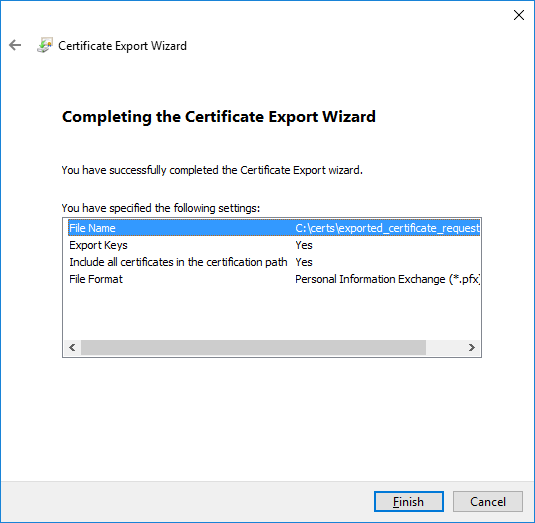

1. Click **Finish**. A dialog box shows a confirmation message.

    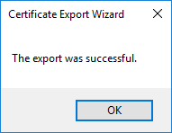

The certificate export is complete.

### Using OpenSSL { #OpenSSL }

[OpenSSL](https://www.openssl.org/) can be used to generate a Certificate Signing Request (CSR). You can also refer to [this tutorial](https://www.ssl.com/how-to/manually-generate-a-certificate-signing-request-csr-using-openssl/) instead.

OpenSSL 3.x changed its default algorithm in pkcs12, which is not compatible with embedded Security frameworks in macOS/iOS and subsequently - in MABS. You can alternatively use OpenSSL 1.x. (more details in [Apple Developer forum](https://developer.apple.com/forums/thread/697030?answerId=701291022#701291022) and in [OpenRadar](https://openradar.appspot.com/FB8988319))

1. Open a terminal and browse to a folder where you would like to generate your keypair

1. Input the openssl command with the following arguments to generate the private key and CSR request:

| Field               | Example                                     |
|---------------------|---------------------------------------------|
| Country Name        | **US** (2 Letter Code)                      |
| State or Province   | **Texas** (Full State Name)                 |
| Locality            | **Dallas** (Full City name)                 |
| Organization        | **Example Inc** (Entity's Legal Name)       |
| Organizational Unit | **IT** (Optional, e.g. a department)        |
| Common Name*        | **www.example.com** (Domain or Entity name) |

*_required_

You should now have a Private Key (privatekey.key) in PEM format, which should stay on your computer, and a Certificate Signing Request (CSR.csr), which can be submitted to a Certificate Authority (CA) to sign your public key.

### Other options { #other }

There are several other options and tools to create a CSR. [This guide](https://www.ssl.com/category/task/csr-creation/), for example, offers a good collection of articles to generate a CSR in various platforms.

* You can find [here](https://www.ssl.com/how-to/csr-generation-in-macos-keychain-access-2/) steps to create a CSR in **macOS** Keychain Access.
* For **Microsoft Azure** users, you can find [here](https://docs.microsoft.com/en-gb/azure/key-vault/certificates/create-certificate-signing-request?tabs=azure-portal) the instructions to create a CSR in Key Vault.
