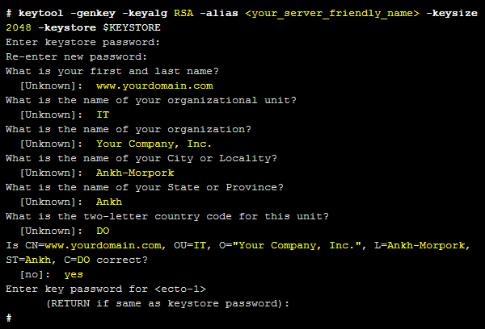
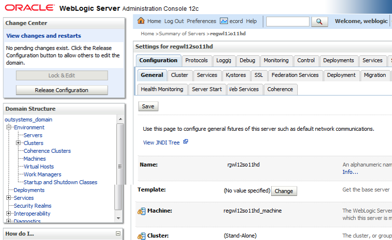
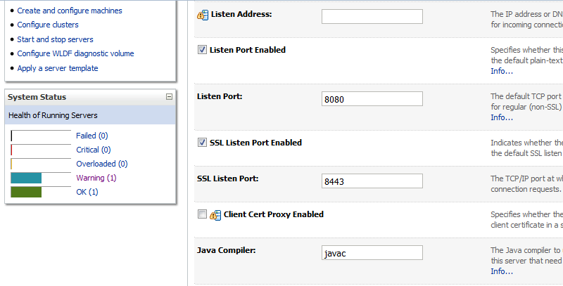
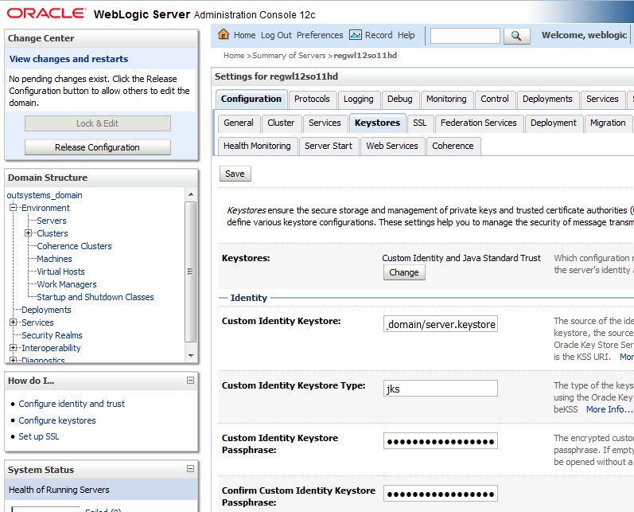
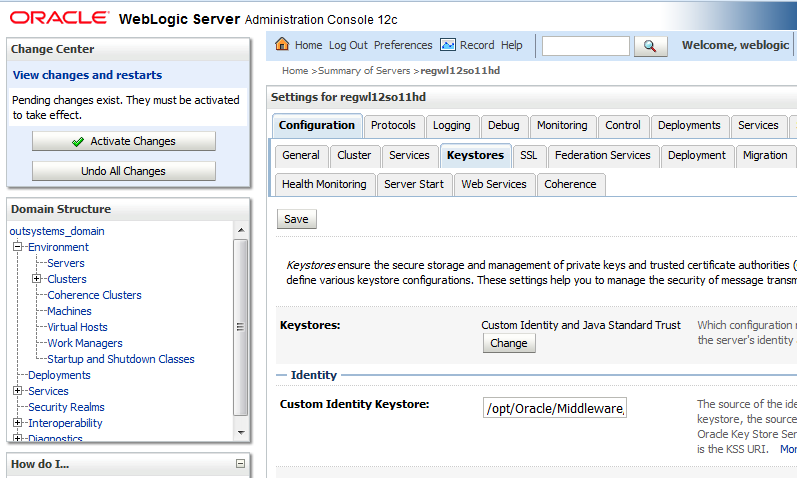

# How to install an SSL Certificate for the OutSystems platform in Linux

<div class="info" markdown="1">
This article applies to **on-premise** or **private cloud** infrastructures. 
**OutSystems PaaS** environments include by default valid SSL certificates with the outsystemsenterprise.com domain. Should you wish to customize your environment domain please refer to [this article](https://success.outsystems.com/Support/Enterprise_Customers/Installation/Enable_Custom_SSL_Domain_In_OutSystems_PaaS).
</div>

An SSL certificate binds a cryptographic key to an organization’s details. When such a certificate is installed in an application server, the HTTPS protocol is activated. This creates an encrypted channel between your web server and your visitor’s web browser, allowing private information to be transmitted without being eavesdropped or tampered.

This document contains instructions on how to request and install a certificate in your application server so that your OutSystems applications can be used over secure connections. It applies to both .NET/Windows and Java/Linux stacks.

These instructions focus on the scenario in which your server is only accessible via the same name, even if over multiple IP addresses. If you need to have your server accessible via two (or more) different names (and IP addresses), i.e., one for the internal and another for the external network, you must repeat these instructions for each name, or use a multi-domain certificate. In such scenarios, please contact OutSystems Support for assistance.

It is expected that you have a fair knowledge of administering a server (including using the command line) and managing certificates, in order to follow this document.

## Requesting the certificate on Linux

In order to install a certificate in your server, first, you need to issue a PKCS#10 Certificate Signing Request. If you already have your certificate and only need to install it, skip this section.

All commands must be run as a user with root privileges:

1. Login as root, or as a regular user and then elevate your privileges to root;

2. Execute the following commands:

    * `source /etc/sysconfig/outsystems`

    * `alias keytool="$JAVA_HOME/bin/keytool"`

The following commands depend on your specific application server and its version, so we will use a variable and instantiate it appropriately.

3. If your application server is Jboss 6 EAP or JBoss 7 Community, execute the following commands:

    * `KEYSTORE=$JBOSS_HOME/standalone/configuration/server.keystore`

    * `ASUSER=jboss`

4. If your application server is Wildfly 8, execute the following commands:

    * `KEYSTORE=$WILDFLY_HOME/standalone/configuration/server.keystore`

    * `ASUSER=wildfly`

5. If your application server is Weblogic, execute the following commands:

    * `KEYSTORE=$MW_HOME/wlserver/user_projects/domains/outsystems_domain/server.keystore`

    * `ASUSER=wls_outsystems`
 
6. Create a Java keystore and a key pair for your domain (if the keystore exists, you will be prompted for its password; if it doesn’t exist it will be created and you will be prompted to enter and re-enter a password for it), by executing the following command:

    * `keytool -genkey -keyalg RSA -alias <your_server_friendly_name> -keysize 2048 -keystore $KEYSTORE`

    * Keytool will now ask you to enter some information needed for your certificate:


 
7. Generate a Certificate Signing Request (CSR) for your domain, by executing the following command:

    * `keytool -certreq -keyalg RSA -alias <your_server_friendly_name> -file certreq.csr -keystore $KEYSTORE`

    * Remember the .csr file name that you choose and the location to which you save it. You will need this file and its contents when ordering a certificate from a certification authority

## Acquiring the certificate

After you have generated your certificate request (the .csr file), you will need to actually acquire the certificate before installing it in your application server. If you already have your certificate and only need to install it, skip this section.

In order to obtain such certificate, you can:

* Contact a certification authority;

* Contact your company's certification authority, if there is one;

* Install a self-signed certificate - this is not recommended for production systems, but it might be an interesting alternative if you just want to see how your application behaves when security is enabled (this document will not pursue this option).

Once you have obtained the certificate, you need to install it in your application server. The following sections include instructions on how to do it, for each of the application servers supported by the OutSystems Platform. These instructions have been written assuming that the platform has already been installed.

## Installing the certificate

After you have acquired your certificate (see the previous section), you can now proceed to install it on your application server. 

All commands must be run as a user with root privileges.

### Importing the (root and) intermediate certificates

If your certification authority provided you with a root and/or one or more intermediate certificates, you will need to install them prior to installing your server certificate. This ensures that you have a proper certification path that validates your server certificate. You will need to repeat these instructions for each intermediate certificate.

1. Login as root, or as a regular user and then elevate your privileges to root;

2. Execute the following command:

    * `source /etc/sysconfig/outsystems`

    * `alias keytool="$JAVA_HOME/bin/keytool"` 

3. Add your **CA Root** certificate to the list of trusted certificates, by executing the following command:

    * `keytool -import -trustcacerts -alias root -file <path/to/root.crt> -keystore $JAVA_HOME/jre/lib/security/cacerts`

    * If you have never changed the password for your cacerts keystore, then the default password is *changeit*;
 
4. Add your **CA Intermediate** certificate to the list of trusted certificates, by executing the following command (be sure to change the alias and path if you need to add more than one intermediate certificates):

    * `keytool -import -trustcacerts -alias intermediate -file <path/to/intermediate.crt> -keystore $JAVA_HOME/jre/lib/security/cacerts`

    * If you have never changed the password for your cacerts keystore, then the default password is *changeit*;

### Importing the server certificate and its chain

1. Login as root, or as a regular user and then elevate your privileges to root;

2. Execute the following command:

    * `source /etc/sysconfig/outsystems`

    * `alias keytool="$JAVA_HOME/bin/keytool"`

The following commands depend on your specific application server and its version, so we will use a variable and instantiate it appropriately.

3. If your application server is Jboss 6 EAP or JBoss 7 Community, execute the following commands:

    * `KEYSTORE=$JBOSS_HOME/standalone/configuration/server.keystore`

    * `ASUSER=jboss` 

4. If your application server is Wildfly 8, execute the following commands:

    * `KEYSTORE=$WILDFLY_HOME/standalone/configuration/server.keystore`

    * `ASUSER=wildfly` 

5. If your application server is Weblogic, execute the following commands:

    * `KEYSTORE=$MW_HOME/wlserver/user_projects/domains/outsystems_domain/server.keystore`

    * `ASUSER=wls_outsystems` 

6. Import your root CA certificate to your keystore by executing the following command:

    * `keytool -import -trustcacerts -alias root -file /path/to/rootCA.crt -keystore $KEYSTORE`
 
7. Import your intermediate CA certificate to your keystore by executing the following command (be sure to change the alias and path if you need to import more than one intermediate certificate):

    * `keytool -import -trustcacerts -alias intermediate -file /path/to/intermediate.crt -keystore $KEYSTORE`

8. Import your server certificate to your keystore by executing the following command (make sure the alias is the same you used when you created the CSR):

    * `keytool -import -trustcacerts -alias <your_server_friendly_name> -file /path/to/yourserver.crt -keystore $KEYSTORE`

9. Ensure that your keystore has the appropriate ownership, by executing the following command:

    * `chown $ASUSER:$ASUSER $KEYSTORE`

### Configuring the application server to use the certificate

#### On Jboss 6 EAP / JBoss 7 Community

1. Login as root, or as a regular user and then elevate your privileges to root;

2. Execute the following command:

    * `source /etc/sysconfig/outsystems`
 
3. Edit the file **$JBOSS_HOME/standalone/configuration/standalone-outsystems.xml** and add an entry like the one below (or update the existing one, if it already exists):

```
<connector name="https" protocol="HTTP/1.1" scheme="https" socket-binding="https" secure="true">
        <ssl password="<your_password>"
        certificate-key-file="${jboss.server.config.dir}/server.keystore"
        ca-certificate-file="${jboss.server.config.dir}/cacerts.truststore"/>
</connector>
``` 

4. Restart Jboss, execute the following command:

    * `/etc/init.d/jboss-outsystems restart`

#### On Wildfly

1. Login as root, or as a regular user and then elevate your privileges to root;

2. Execute the following command:

    * source /etc/sysconfig/outsystems

3. Edit the file **$WILDFLY_HOME/standalone/configuration/standalone-outsystems.xml** and add  the following (or update it, if it already exists) below the *security-realms* element:

```
<security-realm name="SecureApplicationRealm">
        <server-identities>
                <ssl>
                        <keystore path="server.keystore"
                        relative-to="jboss.server.config.dir"
                       keystore-password="<your_password>" />
                </ssl>
        </server-identities>
</security-realm>
```

And the following inside the undertow subsystem after the *http-listener*:

```
<https-listener name="https" socket-binding="https"
security-realm="SecureApplicationRealm"/>
```

4. Restart Wildfly, execute the following command:

    * `/etc/init.d/wildfly-outsystems restart`

#### On WebLogic

1. Open the WebLogic Administration Console, usually available at **`http://<admin_server>:7001/console`**;

2. In the Change Center panel (top left of the screen), click **Lock & Edit**;

3. In the Domain Structure panel (left of the screen), under **outsystems_domain**, click on **Environment** and then on **Servers**:


 

4. On the **Summary of Servers** panel, locate your server and click on its name:


 

5. On the General tab, ensure that **SSL Listen Port Enabled** is checked, and that the port being used is **8443**:


 

6. On the **Keystores** tab, ensure that:

    * **Keystores** is set to **Custom Identity and Java Standard Trust;**

    * **Custom Identity keystore** points to the path where you imported the server certificate above (by default something like `/opt/Oracle/Middleware/wlserver/user_projects/domains/wlserver/user_projects/domains/outsystems_domain/server.keystore)`;

    * **Custom Identity Keystore Passphrase** is set (**Confirm Custom Identity Keystore Passphrase**).


 

7. Click **Save**;

8. In the Change Center panel (top left of the screen), click **Activate Changes**:


 

9. Login as root, or as a regular user and then elevate your privileges to root;

10. Execute the following command:

    * `/etc/init.d/weblogic-outsystems restart`

## Configuring applications to use HTTPS

Once you have installed the certificate by following the steps above, you will already be able to access your OutSystems applications using HTTPS. However, if you want to force THE redirection of all accesses from HTTP to HTTPS:

* In P9 Bali and earlier versions, you must set the HTTP Security property for Web Flows, Web Screens or Integrations (check this [help topic](http://www.outsystems.com/help/servicestudio/9.0/Default.htm#handling_security/about_http_security.htm) for more details)

* In OutSystems 10 and later, you can control this behavior in the same way as before in Web Applications, i.e. at Flow or Screen level, but also for the whole environment, which applies to all Web Applications in the environment, or for specific Web Applications. This is done via LifeTime, when it is installed, or Service Center, when LifeTime is not available.

**NOTE:** You can’t control this behavior for Mobile Applications since they always use HTTPS.

