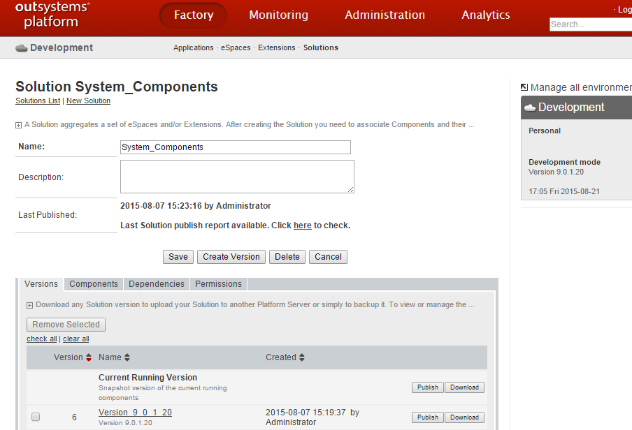
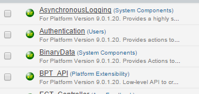

# Install System Components

When installing or upgrading OutSystems Platform, one of the steps in the installation checklist is to install the System Components. The System Components are a set of applications that are part of OutSystems Platform.

## Check the System Components version that is installed

To see what version is already installed on your environment:

1. Navigate to the **environment management console** at `http://<yourenvironment>/ServiceCenter`;

2. Click the '**Factory**' tab;

3. Click the '**Solutions**' submenu;

4. Find the '**System_Components**' solution on the list, and click on it.

Check the System Components version matches the OutSystems Platform version installed:

1. Click the 'Components' tab, to see the applications that are part of the System Components package;

2. Check that all application versions are the same as the OutSystems Platform version that is listed on the right-hand side;

3. If the versions don't match, install the same System Components version as your OutSystems Platform.

## Install System Components

1. Navigate to the **environment management console** at `http://<yourenvironment>/ServiceCenter`;

2. Click the '**Factory**' tab;

3. Click the '**Solutions**' submenu;

4. Click the '**Upload and Publish a Solution**' link. Upload the System_Components.osp file that's on the Platform Server installation folder:

    * .NET - C:\Program Files\OutSystems\Platform Server\

    * Java - /opt/outsystems/platform

5. Click the '**1-Click Publish**' button, to deploy System Components.

