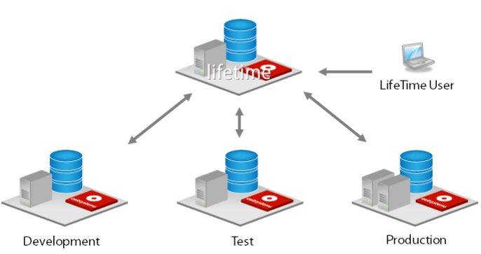

# Size an environment to run the infrastructure management console

The infrastructure management console (LifeTime) must be installed as a **dedicated environment**. This means that it must have it's own dedicated application servers and distinct database catalogs (Microsoft SQL Server) or schemas (Oracle databases).

As opposed to previous versions, installing LifeTime in  another environment (for example, in development or in production) isn't supported from version OutSystems 11 onwards.

## Sizing the environment

Once you install OutSystems platform, it automatically starts to collect client-side metrics of the applications running in the Production environment. You can then use LifeTime to customize which applications you want to monitor and which it doesn't make sense to do so. For the application you choose to monitor the user experience, OutSystems automatically adds monitoring probes, and for each client request to those applications, metrics are collected and stored in the environment in which the application is running for a period of 48 hours.

The LifeTime environment has the same requirements as any other environment, but due to its capabilities, you need to understand how to properly size the storage capacity of the server in which it will run. 

You can estimate the storage needed for the applications you are monitoring. Consider you're only monitoring a subset of the applications running in production:

**_MaximumStorageNeededInProduction = AveragePageViewsPerDayOfMonitoredApps * 2 days * 1100 Bytes_**

As an example, imagine that the application you are monitoring in Production has 1 million page views in 2 days (distributed between all the applications), the database size will increase approximately 2.05GB. LifeTime periodically copies the collected metrics from Production to its own database and also keeps this copy for a period of 48 hours. However, LifeTime does an aggregation of collected metrics and stores this information permanently. To estimate the storage needed for Lifetime’s database, calculate it as follows:

* A fixed storage size equal to what was calculated for the above.

* Add a constant daily growth due to the aggregated metrics:
**_AverageLifeTimeDBDailyGrowth = AveragePageViewsPerDayOfMonitoredApps * 100Bytes _**

In this example, the LifeTime database would start by having 2.05GB, and increase 95 MB daily. Furthermore, if you have LifeTime database set to use full-recovery model (SQL Server) or Archivelog (Oracle), the transaction log will increase with each Insert and Delete operation performed by LifeTime Performance Monitoring.

To estimate the growth of the transaction log, you can calculate it as follows:

**_TransactionLogsAvgDailyGrowth = AvgDailyPageViewsOfMonitoredApps * AvgRecordSize * 3_**

In this example, if both the Production database and LifeTime environment database where set to fullrecovery / archivelog, then each would grow by 3.3GB per day.

LifeTime will only keep the analytics data for a default period of 365 days. This value can be altered using [Factory Configuration](https://www.outsystems.com/forge/component-overview/25/factory-configuration).

## Install the infrastructure management console

The infrastructure management console (LifeTime) must be installed in a **dedicated environment**. [Learn how to install the infrastructure management console.](https://success.outsystems.com/Documentation/11/Setting_Up_OutSystems#Install_the_infrastructure_management_console)

