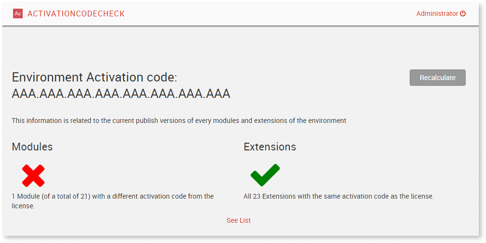

# Resolve an intellectual property error

During development you may receive an "Invalid Intellectual Property" (IPP) error message. 
These error messages can occur if you are publishing a module for the first time in your environment or this module was protected at some point. Errors occur during development when publishing your module in Service Studio, in Service Center, or deploying through LifeTime.


Following are two sample error messages:

```Invalid Intellectual Property: You are trying to upload or publish a solution that was created in a Platform Server and its intellectual Property is protected.```

```Intellectual Property Error: This module is under Intellectual Property Protection, so you cannot publish it to your environment. Go to http://www.outsystems.com/ipp and request rights to use this module.```


This error means that the module you’re trying to publish originated in an infrastructure with a different Activation Code. Because it’s intellectual property was never transferred, this error occurs.

[Check here](what-is-ipp.md) for more information about OutSystems intellectual property.


## Checking for further IPP errors in an infrastructure

<div class="info" markdown="1">

It may happen that apps previously published in your infrastructure return an IPP error when re-published. In this case, it’s advisable to check all the apps in  your infrastructure. The next section provides information to help you check your apps. 

</div>

Since it's difficult to find all occurrences of this pattern, we created an OutSystems app. You can deploy this app to your environment to locate modules with similar issues.

With this app, you can check all the modules of an environment and act only on flagged modules.

The overall process consists of:

1. Checking your environment for modules that will have the IPP error.
1. Fixing modules that will have an IPP error.

### Checking an environment for further errors { #check-environment }

To confirm you have any modules that will have the IPP error when published, follow these steps:

1. Download the appropriate ActivationCodeCheck app for your infrastructure type:

    | OutSystems version | App to download |
    |---|---|
    | **OutSystems 11** | [ActivationCodeCheck 11](files/ActivationCodeCheck-O11.oap) |
    | **OutSystems 10 .NET** | [ActivationCodeCheck 10 .NET](files/ActivationCodeCheck-O10.oap) <br/> **Note**: In this version you'll get a warning message that states "Missing Module/Dependency BulkInsert". It's safe to dismiss it.|
    | **OutSystems 10 Java** | [ActivationCodeCheck 10 .Java](files/ActivationCodeCheck-O10-Java.oap) |

1. Publish the ActivationCodeCheck app in your environment.
1. Open the ActivationCodeCheck app in your browser and login with your IT user credentials.

    If both checks are green, the modules present in your environment won't return an IPP error when re-published. In this case, no further action is necessary. 

    

    If a red cross displays , further action is necessary to avoid IPP errors when re-publishing. Proceed to the next section.

    

### Fix modules that will get the IPP error

If any modules or extensions were flagged with a red cross, you’ll need to fix the IPP flagged issues.

To fix the errors, follow these steps:

1. Click **See List** to display the list of modules that need to be updated to stop the IPP errors from occurring in your current factory.

1. From the **Status** dropdown select **Not OK** and click the **Export to Excel** button.

    

    Note the **Name** of the modules listed. For your convenience, you can also export the results to Excel. In the Excel output, the modules are marked as "Not OK" in the "Label" column.

1. Go to Service Center, create and download a solution that includes the modules from the list.

1. Upload the solution in the [IPP portal](http://www.outsystems.com/ipp/) to change the activation code to your infrastructure.

1. When you receive the email with the solution, publish the solution in the email in the environment.

1. Repeat this process for all non-production environments in your infrastructure. If your apps are all staged to production via LifeTime, it won’t be necessary to execute this procedure in production.

## Resolve the error for a single application


The [IPP portal](http://www.outsystems.com/ipp/) allows you to transfer the intellectual property of modules. Once the intellectual property is transferred to your Activation Code, the IPP error no longer occurs.

To transfer the intellectual property, follow these steps:

1. Upload the application in the [IPP portal](http://www.outsystems.com/ipp/) to change the activation code.

1. When you receive the email, publish the app received in the email in the environment. 
