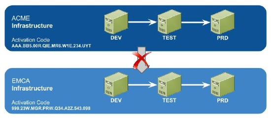

# What is IPP (Intellectual Property Protection)

The Intellectual Property Protection (IPP) feature **ensures that your applications can't be deployed to another infrastructure without your consent**. You can deploy applications across all the environments of the same infrastructure, but you'll not be able to deploy applications to environments belonging to other infrastructures.​

## IPP under the hood

When you deploy a module, it is marked with the [activation code](https://success.outsystems.com/Support/Enterprise_Customers/Licensing/Overview/01_How_OutSystems_Platform_licensing_works) of your infrastructure. From that moment on, that module can only be deployed to environments with the same activation code. You also won't be able to copy-paste parts of applications that are IPP-protected.

In this example, applications developed in any environment of the ACME infrastructure can be deployed to any environment of ACME. However, it won't be possible to deploy those applications to the EMCA infrastructure.

## Deploy applications to other infrastructures

To be able to deploy applications to outside the infrastructure they belong, use the [IPP portal](http://www.outsystems.com/ipp/). This service allows you to change the activation code of your applications. After going through the process, you'll be able to publish the applications in a different Infrastructure.

All IPP portal operations are logged. If you want to check the IPP operations performed in your applications, [contact support](https://success.outsystems.com/Support/Enterprise_Customers/OutSystems_Support/01_Contact_OutSystems_technical_support)

## Block changes to your applications

For additional protection of your intellectual property, you can block the use of the IPP Portal for all applications developed in your infrastructure. [Contact support](https://success.outsystems.com/Support/Enterprise_Customers/OutSystems_Support/01_Contact_OutSystems_technical_support) to learn more about this option.

