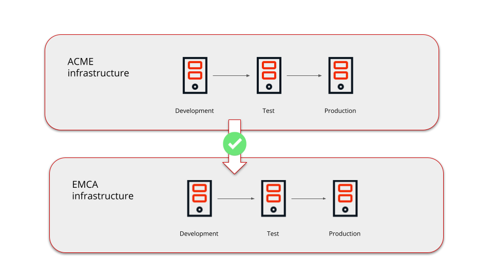
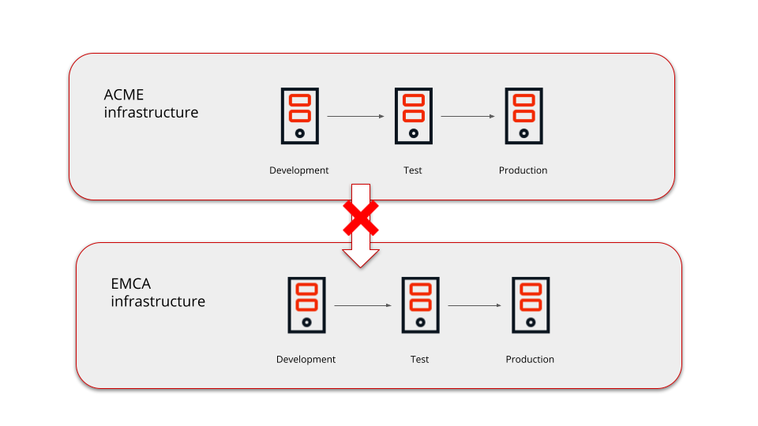

# What is IPP (Intellectual Property Protection)


<div class="info" markdown="1">

**Important update**: License files made available from April 2021 onwards are issued with IPP **unprotected** to ensure you can share your apps with other infrastructures.

</div>

The Intellectual Property Protection (IPP) feature **ensures that your apps can't be deployed to another infrastructure without your consent**. You should always be able to deploy apps between environments of the same infrastructure.
By default, the IPP  is **unprotected**, which means your application can be deployed to other infrastructures. To request your IPP to be **protected**,  [contact support](https://success.outsystems.com/Support/Enterprise_Customers/OutSystems_Support/01_Contact_OutSystems_technical_support).

When the IPP feature is **protected**, you can deploy applications across all the environments of the same infrastructure, but you can't deploy applications to environments belonging to other infrastructures.​

## IPP unprotected 

By default when you deploy a **new module**, it is not marked with the [Activation Code](https://success.outsystems.com/Support/Enterprise_Customers/Licensing/Overview/How_OutSystems_licensing_works) of your infrastructure. From this point onwards you can share your modules with other infrastructures.



In this example, applications developed in any ACME environment infrastructure can be deployed to any ACME environment. However, you can't deploy those applications to the EMCA infrastructure.

If you are trying to deploy modules from other infrastructures, you might get the error message:

```Invalid Intellectual Property: You are trying to upload or publish a solution that was created in a Platform Server and its intellectual Property is protected```

If that’s the case, check [this article](ipp-error.md).


## IPP protected 

When you deploy a module, it is marked with the [activation code](https://success.outsystems.com/Support/Enterprise_Customers/Licensing/Overview/01_How_OutSystems_Platform_licensing_works) of your infrastructure. From then on, you can only deploy this module to environments with the same activation code. In addition, you can't copy and paste parts of applications that are IPP-protected.



In this example, applications developed in any ACME environment infrastructure can be deployed to any ACME environment. However, you can't deploy those applications to the EMCA infrastructure.


### Deploy applications to other infrastructures 
To deploy applications to an infrastructure to which they do not belong, use the [IPP portal](http://www.outsystems.com/ipp/). Using the IPP portal service you can change the activation code of your applications. When you complete the process, you can publish applications in different Infrastructures.  
OutSystems logs all IPP portal operations. 

To check the IPP operations performed in your applications, [contact support](https://success.outsystems.com/Support/Enterprise_Customers/OutSystems_Support/01_Contact_OutSystems_technical_support).
