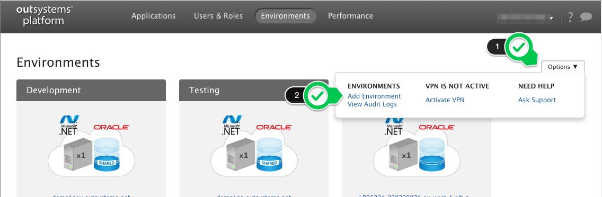
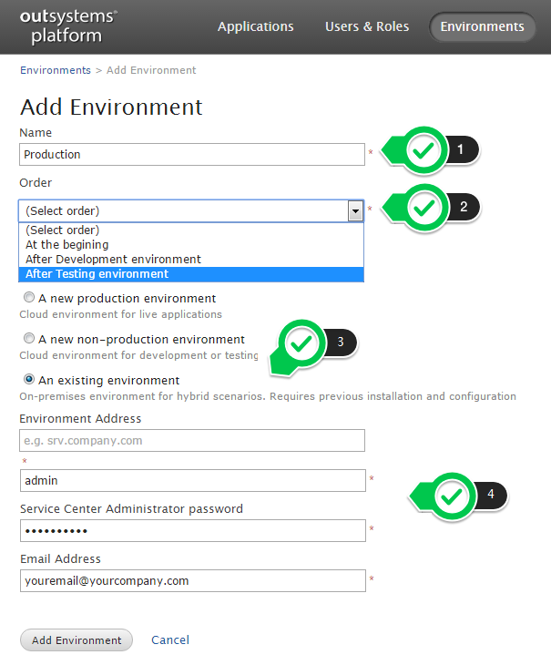

# Add a new environment to your infrastructure

The steps to add a new environment to your infrastructure will depend on the type of your Infrastructure. Check below the instructions according to your infrastucure type.

## On OutSystems Cloud

If you're using OutSystems Cloud, navigate to the infrastructure management console (LifeTime). On the right-hand side, click the '**Options**' menu, and choose '**Add Environments**'.

We'll contact you if we need more information, or if this implies changes to your subscription.

### Add a new OutSystems Cloud environment to infrastructure

To add a new OutSystems Cloud environment to your infrastructure, select either option "A new production environment" or "A new non-production environment". Name the environment as you wish and select the correct order of the environment.

### Add a self-managed environment to your OutSystems Cloud infrastructure

If you're setting up a hybrid infrastructure, select the option "An existing environment". Input the IP address or hostname of your self-managed environment and its Service Center "admin" user credentials. Make sure the environment you are adding has [SSL enabled](https://success.outsystems.com/Documentation/11/Managing_the_Applications_Lifecycle/Secure_the_Applications/Use_HTTPS_by_Enabling_SSL).

Hybrid configuration is only supported in OutSystems licenses purchased before January 2020.

If you are performing this action with a user with undefined email, you will be prompted for your email. This email will be associated with your LifeTime user from that point on.

## On-premises

If you're using OutSystems Platform on-premises, you need to get a license for the new environment. To learn more about this, see [How to get a license file for an environment](https://success.outsystems.com/Support/Enterprise_Customers/Licensing/02_Manage_and_Upgrade/03_Get_a_license_file_for_an_environment).

Each subscription has a limit on the number of environments that can be licensed. If you need to add more environments but have exceeded the limit of your subscription please [contact support](https://success.outsystems.com/Support/Enterprise_Customers/OutSystems_Support/01_Contact_OutSystems_technical_support).

After you have obtained the license and installed it in your environment, you'll need to register the environment on your infrastructure, following [these steps](https://success.outsystems.com/Documentation/11/Setting_Up_OutSystems/Configure_the_infrastructure_management_console).

