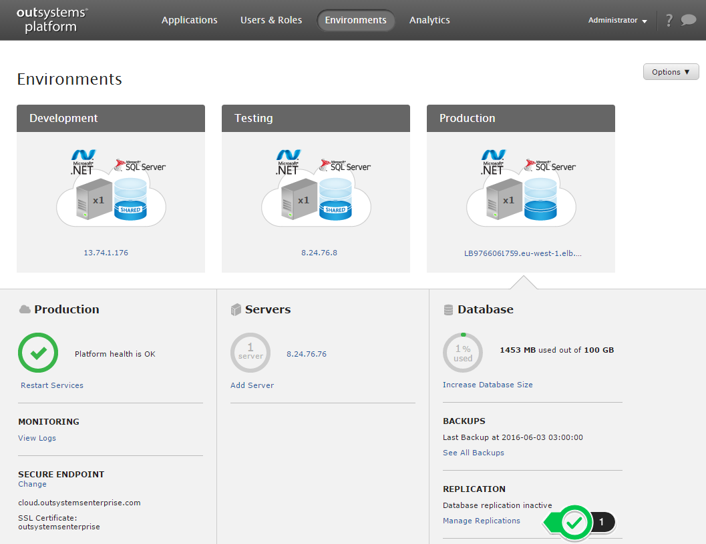

# Enable Database Replica

## What are the benefits of this feature?

For the high availability configuration, an organization's production database instance has a "standby" replica in a different availability zone. If the Production Database Server fails, the up-to-date standby replica automatically takes over. Database operations can resume quickly after a failure or planned maintenance.

## When to use this feature?

Use this feature to enable the Database Replica in your Production environment.

## How to enable the Database Replica on your Production environment?

### On the cloud

If you're using the cloud-based version, navigate to the infrastructure management console (LifeTime). Go to the '**Environments**', select your Production environment menu, and choose '**Manage Replications**'.

A confirmation screen will ask you to confirm. After you click '**Start Database Replication**', the OutSystems Cloud Infrastructure will enable the Replication mechanism.

A new database server replica service will be put in place in a different location within the same geographic region. Synchronization of data and current transactions will occur automatically between the running database and the standby replica.

You may experience up to five minutes of downtime after taking this action due to the need of changes in the underlying host infrastructure.

We'll contact you if we need more information, or if this implies changes to your subscription.

##### **Additional notes for VPN Users**

Please note that if you are accessing your Cloud Infrastructure's Database Server through a VPN connection, the private IP address of the Database will change.

