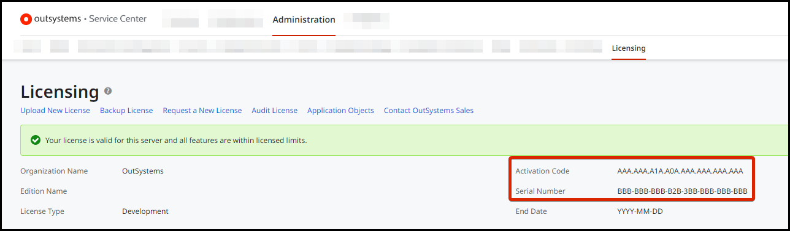

# Find the Activation Code and the Serial Number

After subscribing, we'll send you an email with the Activation Code. If you haven't received an email with your Activation Code, [contact support](https://success.outsystems.com/Support/Enterprise_Customers/OutSystems_Support/01_Contact_OutSystems_technical_support).

If you're using an infrastructure that's already licensed, you can find the Activation Code in Service Center, the environment management console. Navigate to the environment console at `https://<yourenvironment>/ServiceCenter`, click the **Administration** tab, and then **Licensing**.

On the right side, you'll find:

* The Activation Code of the infrastructure that's always the same in all the environments of the factory.
* The Serial Number of the environment, each environment has it's own distinct serial number,

