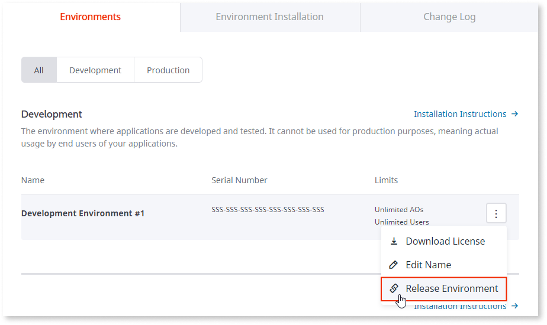

# How to free up an existing environment in licensing

This article explains how you can release an environment serial number in the [Customer Portal](https://www.outsystems.com/licensing/), which may be necessary when performing the following operations:

* upgrade the OutSystems Platform Server; 

* transfer an OutSystems environment across servers;

* change server hardware;

* sunset an existing OutSystems environment.

On any of these operations, it's possible that the serial number of the environment changes. If that's the case, you'll need to release the serial number associated with the environment and register a new one. Once you've done that, you can download an updated license file.

If you need assistance while installing and managing your server licenses [contact OutSystems Support](https://success.outsystems.com/Support/Enterprise_Customers/OutSystems_Support/01_Contact_OutSystems_technical_support).

## Releasing an existing environment

Access the [Customer Portal](https://www.outsystems.com/licensing/) and select your infrastructure:

Look up the environment to release (making sure that the serial number matches):

1. Click **Release Environment**.

1. Fill in the reason for the release.

1. Click **Release**.

If your infrastructure has been flagged for abuse the environment release won't be immediate: it will trigger a request to OutSystems to review your request.

