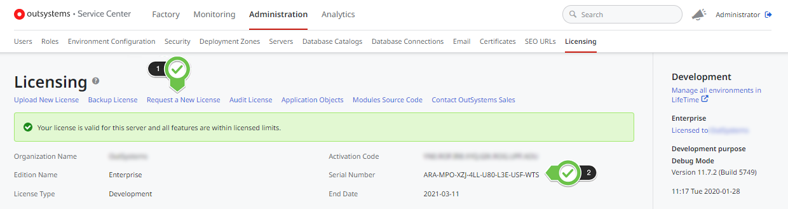
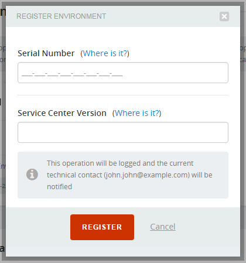
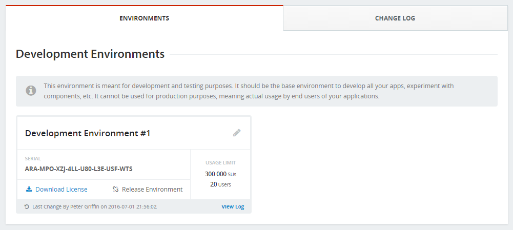
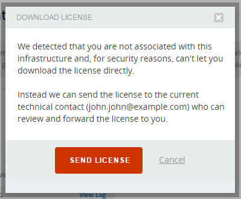

# Get a license file for an environment

This article contains the steps to obtain OutSystems licensing files: necessary while installing and upgrading your OutSystems self-managed environments.

## Cloud environments

**The OutSystems team manages all the licensing** of your **cloud environments**. When you get a new cloud environment, it is already activated and ready for you to start using it.

## On-premises environments

For your **on-premises environments, you'll need to obtain and install the license in each environment**.

To get a license for an environment, navigate to the **environment management console** at `http://<yourenvironment>/ServiceCenter`. In the '**Administration**' tab, navigate to the '**Licensing**' submenu.

Then click the '**Request a New License**' link.

You'll be redirected to the [Licensing portal](http://www.outsystems.com/licensing/), where, after logging in with a valid OutSystems account you'll be able to pick which infrastructure you are managing:

If your infrastructure is not visible in the drop-down it means that you are not associated with that infrastructure in your [Account Settings](https://www.outsystems.com/CustomerArea/) area.
Only [authorized members](https://success.outsystems.com/Support/Enterprise_Customers/OutSystems_Support/Managing_Your_Company_Permissions_on_outsystems.com#What_are_your_access_levels.3F) will be able to access.

### Registering your environment (using the serial number) { #register-env-serial-number }

If you haven't registered your environment yet on the Licensing portal, you'll have to first register it.

Scroll down on the page to find an environment that doesn't have an associated serial number, taking special care to select it the right "environment type":

The image above shows an infrastructure with a single environment of type "Development". What you will see on this page will vary depending on your OutSystems subscription.

Click '**Register Environment**', and **enter the Serial Number** and [**Service Center Version**](https://success.outsystems.com/Support/Archive/What_version_of_OutSystems_Platform_am_I_using#Metadata_database_.26_Service_Center) of the environment you want to register.

Don't have any more environments available? See [how to free up an existing environment](https://success.outsystems.com/Support/Enterprise_Customers/Licensing/Manage_and_Upgrade/05_How_to_free_up_an_existing_environment_in_licensing) or contact your OutSystems account manager.

### Getting the license file

The environment will become associated with the Serial Number you entered and you will then be able to download the license file:

The permissions to download license files are managed at the [Customer Portal](https://success.outsystems.com/Support/Enterprise_Customers/OutSystems_Support/Managing_your_company_permissions_on_outsystems.com#Customer_Portal_permissions).

Users without permissions to download a license file will be taken through an additional validation step:

When you click '**Send License**' the license file is sent by e-mail to the contacts (**financial, technical and additional contacts**) registered for your subscription.

Upon receiving the email above, any of the recipients can review your request and forward the license file so that you can continue with the OutSystems Platform installation.

## More Information

To learn how to install a license in your environment, check [How to install a license file](https://success.outsystems.com/Support/Enterprise_Customers/Licensing/02_Manage_and_Upgrade/04_How_to_install_a_license_file).

