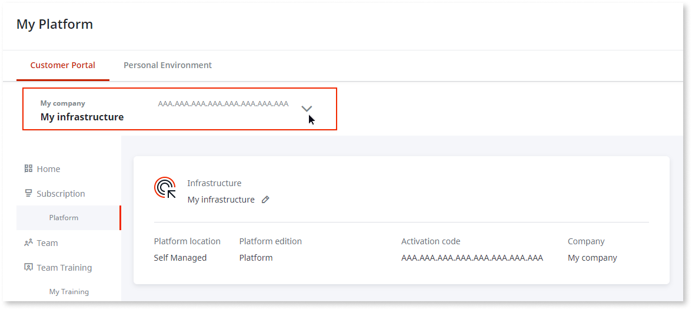
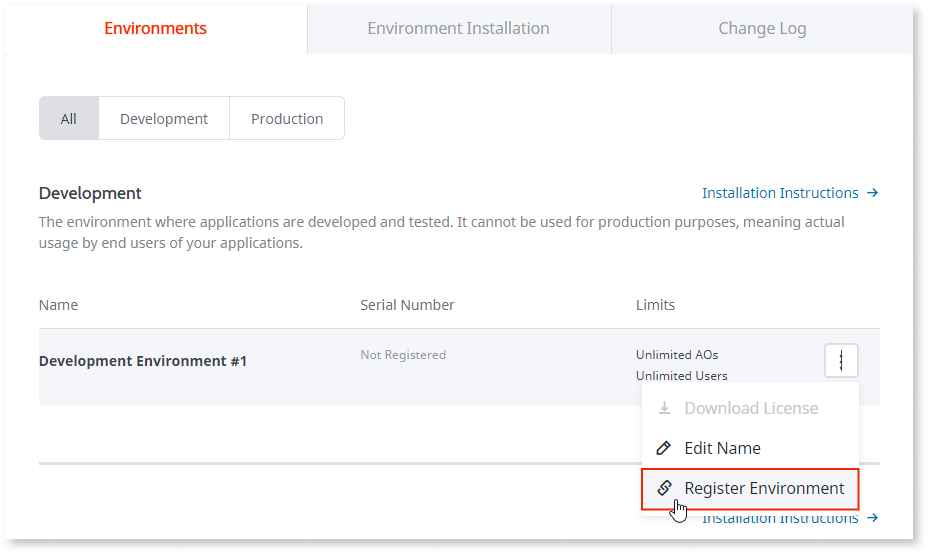
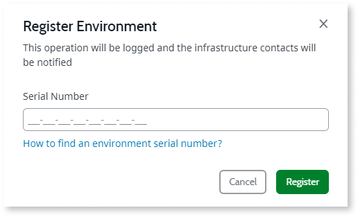
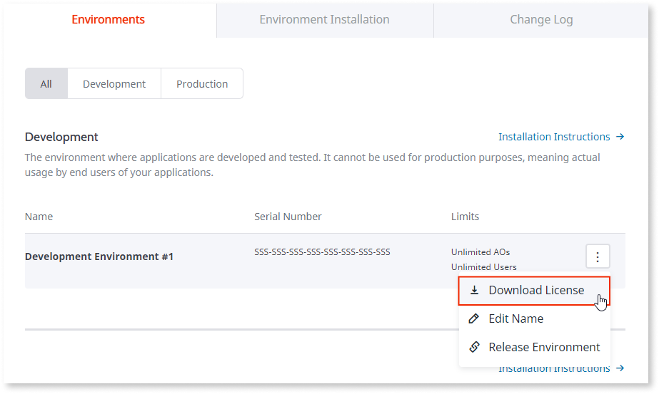

# Get a license file for an environment

This article contains the steps to obtain OutSystems licensing files, which are required while installing and upgrading your OutSystems self-managed environments.

## OutSystems Cloud environments

The OutSystems team manages all the licensing of your OutSystems Cloud environments. When you get a new cloud environment, it's already activated and ready to use.

## Self-managed environments { #self-managed }

For your self-managed environments, you'll need to obtain and install the license in each environment. At [Customer Portal](http://www.outsystems.com/licensing/) you can manage the licenses for your subscriptions.

Pick the infrastructure you're managing:

If your infrastructure isn't visible in the drop-down, you aren't associated with that infrastructure in your Customer portal.
Only [authorized members](../../../community/customer-portal.md) will be able to access.

Once in Customer Portal, you'll need to:

1. Register the serial number of the environment.
1. Get the license file. 
1. Install it in your environment. 

Check the following sections for instructions.

### Register the serial number { #register-env-serial-number }

To obtain a license, you'll first need to register the environment using its serial number. Registering an environment consists in associating the serial number (obtained in Service Center) with an environment slot and allows you to download a license file. If you haven't yet registered your environment on the Customer Portal, follow these steps:

1. Scroll down on the page to find an environment that doesn't have an associated serial number, taking special care to select the right "environment type":

    

    The image above shows an infrastructure with a single environment of type "Development". What you see on this page depends on your OutSystems subscription.

1. Click **Register Environment**, and enter the serial number of the environment that's obtained from Service Center.

    

Don't have any more environments available? See [how to free up an existing environment](free-up-environment.md) or contact your OutSystems account manager.

### Getting the license file { #get-license }

The environment is now associated with the serial number and you can download the license file:

The permissions to download license files are managed at the [Customer Portal](https://success.outsystems.com/Support/Enterprise_Customers/OutSystems_Support/Managing_your_company_permissions_on_outsystems.com#Customer_Portal_permissions).

### Install the license

To learn how to install a license in your environment, check [How to install a license file](howto-install-license.md).
