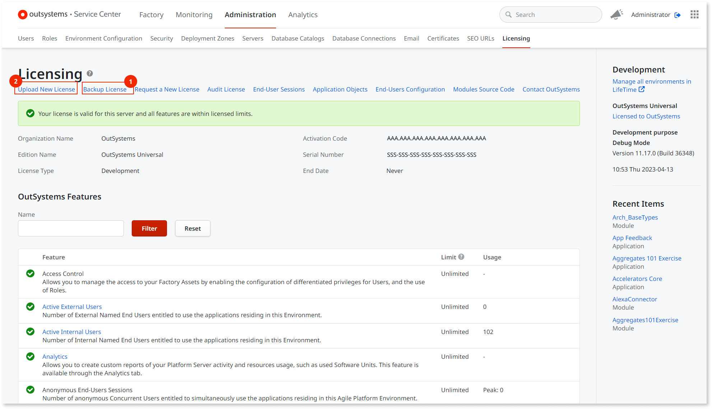

# How to install a license file

This article applies to on-premises environments. For OutSystems Cloud, the services team manages the license installation automatically, updating it or renewing it as necessary.

Follow these steps to install the license file on your environment:

1. Navigate to the environment management console at `http://<yourenvironment>/ServiceCenter`;

1. Click the '**Administration**' tab, and navigate to the '**Licensing**' submenu;

1. Use the '**Backup License**' (1) link to download the license currently installed. It's always a good idea to keep backups;

1. Click the '**Upload New License**' (2) link, to install the new license.

License files are bound to a given environment / Serial Number and if you try to install them on other environments you'll get an error.

If that happens you should confirm that you have the correct file by comparing the Serial Numbers shown in Service Center and Licensing Portal.

## More information

You should also check:

* [How to get a license file for an environment](get-license-for-env.md)

* [Identify OutSystems infrastructure and runtime environments](https://success.outsystems.com/support/licensing/identify_outsystems_infrastructure_and_runtime_environments/)
