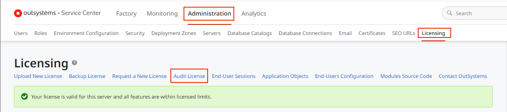
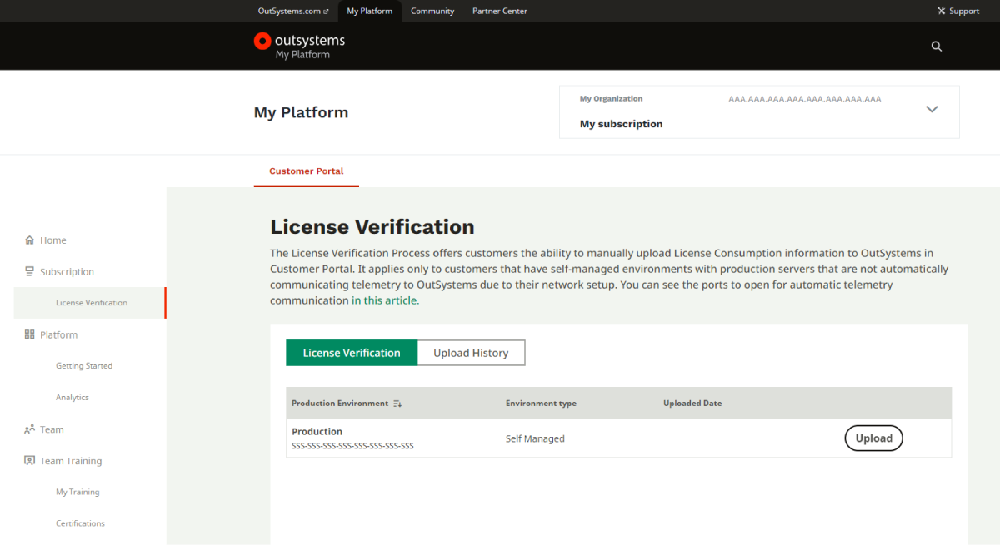

# License verification

## What is the License Verification process?

The License Verification Process is a process that allows customers to manually upload License Consumption information to OutSystems in the Customer Portal. 

It applies only to customers with self-managed environments with production servers that do not automatically communicate telemetry to OutSystems due to their network setup. [This article](https://success.outsystems.com/documentation/11/setup_and_maintain_your_outsystems_infrastructure/setting_up_outsystems/outsystems_network_requirements/) details the ports that need to be opened to enable automatic telemetry communication.

## How do I download the License Verification file for my production server?

You can download the License Verification file for a Production Server by doing the following:

1. Open **Service Center** for your production server, with Administrator rights.
1. In Service Center, go to **Administration** and then **Licensing**.
1. From the **Licensing** menu, select **Audit License** option as shown in the image below:

    

    A file with the name OutSystems.Audit.txt is downloaded.

1. Access your **Customer Portal** and **upload** the file in the **License Verification** panel:
    
    

    

Make sure that you download the file from the production server with the same Activation Code that you want to Verify in the Customer Portal

After you upload the file, Customer Portal will validate and securely register the License consumption information. You can track the history of all the License Verification files you uploaded to the Customer Portal in the **Upload History** tab above.

