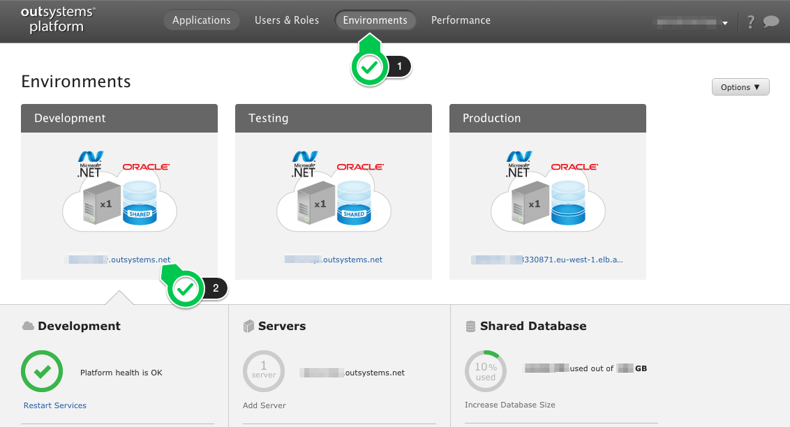

# How to access your OutSystems Platform

The easiest way to access your OutSystems Platform, is to navigate to the infrastructure management console. This console lets you have a bird's-eye view of your OutSystems Platform.

If you're using OutSystems Platform in the cloud, you'll receive an email with the URL of this console.​

## Frequently Asked Questions

### What is Lifetime?

This is the infrastructure management console. You can access it at `http://<management_environment>/lifetime`.

You can easily navigate from here to the management console of each environment.

### What is Service Center?

This is the environment management console. You have one console for each environment, and can access them at `http://<environment>/ServiceCenter`.

