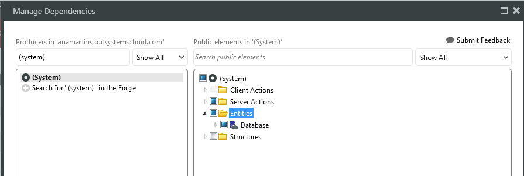

# Application Object count

This article explains how application objects are counted.

## What are application objects?

Application objects are elements of your application:

* [**Pages**](https://success.outsystems.com/Support/Enterprise_Customers/Licensing/Overview/Application_Object_count#What_constitutes_a_page.3F): The screens you design or install in your environment for end users. These can include web screens, email screens, mobile web screens and SMS screens as designed in the visual development environment. For example, a pop-up web screen or a Supplier_List web screen each equals 1 application object.

* **Tables**: Entities that you design with Outsystems Platform or import for integration from external databases or both. Each Local Storage entity (applicable to mobile) will count 1 additional AO, regardless if it is a new entity or an existing one.

* [**API/Service operations**](https://success.outsystems.com/Support/Enterprise_Customers/Licensing/Overview/Application_Object_count#Examples_of_API.2FService_operation_counts): Methods from web services, REST APIs or integration connectors that you consume or expose. APIs in extensions, the C# code that you reuse in OutSystems Platform, are not accounted for.

## What constitutes a page?

Pages are the web screens, email screens, mobile web screens, SMS screens as designed in the visual development environment. Web blocks are not pages, but screen components. Therefore they’re not counted.

### When a single page includes multiple tabs, what is counted?

If each tab is implemented in a different web screen in the designer, they are different pages and each is an application object. If each tab is implemented in the same screen with web blocks or inline, they all constitute just 1 page or 1 application object.

### What about pop-ups on a single page?

If the content of the popup is a different web screen, the screen in the popup is counted as a page and therefore is an application object. This is the default when you scaffold a popup or use Richwidgets popup components. 

Usually, a tiny help message will not have its own screen, but will instead be something like a tool tip and therefore is not counted as an application object. If the popup has some transactional logic, it is usually implemented in a different screen and therefore counts as an application object. The developer will decide the best design.

## Do internal system database tables count for the application object total?

* In web applications, internal database tables used by OutSystems Platform are not part of the application count total when referenced.

* In mobile applications, they will also not count when referenced in "entities" however, if when added to the Local Storage they will count 1 AO.

* **What constitutes as "internal system database tables"?**

These are the entities listed under the (System) eSpace that you can find while managing dependencies:

## Examples of API/Service operation counts

When consuming [Google Calendar APIs](https://developers.google.com/google-apps/calendar/v3/reference/#CalendarList):

* Each method defined there and that you import to the platform is one API

* Each counts as 1 application object.

For 3 SAP BAPIs consumed via a WebReference or through Platform Connect for SAP:

* Consider these three BAPIs: GetCustomers, CreatePurchaseOrder, GetCustomersPOs.

* Each counts as 1 application object for a total of 3. 

For a CustomerInformation web service with 4 actions:

* SearchCustomers, GetCustomerDetail, CreateCustomer, UpdateCustomerDetail are 4 web service methods exposed to a third party system

* Each equals 1 application object for a total of 4.

A REST web reference  with 14 methods equals 14 application objects.

## Are there elements that count as two or more application objects?

No, all application elements that contribute to the application object count only count as one AO. Always.​​

 

## Do "disabled" applications count for the AO limit?

When an application is set to "Disable", the Application Objects will continue to count to the overall AOs total count on the environment.

