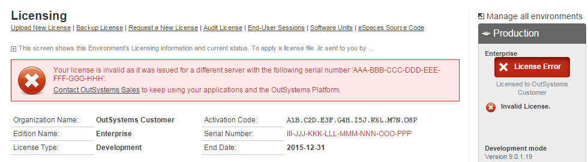

# Changed the hardware and the license stopped being valid

## About the serial number generation

An environment's Serial Number is automatically generated by the OutSystems Platform based on the hardware of the server with the **Deployment Controller role** for that environment.

### What can cause it to change?

* Restarting the deployment controller server hosted on a Virtual Machine.

* Changing the physical network devices of that server, changes the environment serial number, making your license invalid.  

* Promoting a front-end server to deployment controller can also make your license invalid. 

When this happens you will see a License Error stating:

The license found is not valid for this server because it was issued to a server with serial number...

### What do you need to do to restore your license?

Since the serial number has changed the license installed is no longer valid and you will need to get a new one on the [Licensing portal](https://www.outsystems.com/licensing/):

1. [find and release the previous environment in licensing](../manage/free-up-environment.md)

2. [register the environment using the new serial number](../manage/get-license-for-env.md#register-env-serial-number)

3. [install the license file](../manage/howto-install-license.md)

### What can you do to prevent this from happening?

* If this happened after a **restart** of the deployment controller server hosted on a **Virtual Machine**, the most common case is that the VM's Mac address changed after the restart.

Most modern VMs have an option to keep the Mac address when restarted. Reach out to your infrastructure admin to configure this option.

* The only other causes for the serial number to change (replacement of physical network devices and promoting a front end to controller) are typically done by necessity, this will hardly be avoidable and the license will have to be updated and replaced.

