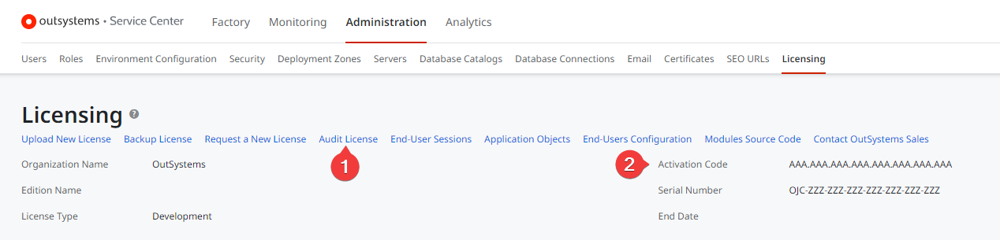

# I have reached my license limits

Each license has certain usage limits, such as number of users, Application Objects, or environments. 

OutSystems will work with you to ensure that overuse of your subscription won't impact your current activities. Your account executive will be able to assist you in upgrading your licenses.

[Contact support](https://success.outsystems.com/Support/Enterprise_Customers/OutSystems_Support/01_Contact_OutSystems_technical_support) for help on troubleshooting your license usage or upgrading your license. To speed up this process, be sure to include your **Audit License** (1) and **Activation Code** (2).

For more information check the [OutSystems Platform licensing FAQ](https://success.outsystems.com/Support/Enterprise_Customers/Licensing/Overview/01_How_OutSystems_Platform_licensing_works).

