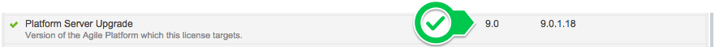

# Upgraded an infrastructure and the license stopped being valid

**Your license might be limited to a specific OutSystems Platform version**. Some licenses are associated with a specific OutSystems Platform version, to ensure the license has all the capabilities that a platform version supports.

You can check if your license is limited to a particular version, in the environment management console. [In the 'Licensing' screen](https://success.outsystems.com/Support/Enterprise_Customers/Licensing/02_Manage_and_Upgrade/07_Check_what_your_license_includes%2C_and_your_effective_usage), search for the '**Platform Server Upgrade**' entry. In this example, the license is limited to the 9.0 version.

Even if your license allows to upgrade to a newer version, there may exist features in the newer version that require a new license to become active. To understand the capabilities of newer OutSystems Platform versions, and whether you'd benefit from upgrading your license, contact your account manager.

## Upgrade to an higher version

To upgrade to a version higher than you license allows, you’ll need to obtain new licenses.

To request the creation of new licenses you should contact licensing@outsystems.com. To speed up the process specify both your Activation code, and the version you'll be upgrading to. When you receive a confirmation about your license upgrade from the support team, you can download the new licenses for each environment on the [Licensing portal](https://www.outsystems.com/licensing/).

## More Information

Be sure to check [How to install an OutSystems Platform license](https://success.outsystems.com/Support/Enterprise_Customers/Licensing/02_Manage_and_Upgrade/04_How_to_install_a_license_file).

