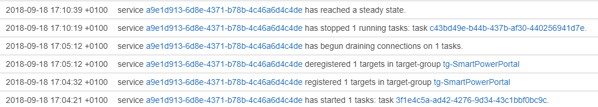

# No-downtime deployments with Amazon ECS

## Staging from Classic Virtual Machines to Amazon ECS

1. **Publish the application to Amazon ECS.**

    Follow the guide on [Deploying an Application to a Docker Container](<https://success.outsystems.com/Documentation/11/Managing_the_Applications_Lifecycle/Deploying_to_Containers/Running_Your_Application_in_a_Container/Deploying_an_Application_to_a_Docker_Container>) up to "Create result file for the deployment step" (at the end of step 6).

    

    _Note:_ **Do not create** the `.deploydone` result file.  
    This would cause the un-deployment of the application from the deployment zone configured with "Classic Virtual Machines" hosting technology.
    
    

1. **Verify the status of the application before switching it between deployment zones.**

    Check that the application modules are accessible at the following address:

    `<zone_address>/<module_name_N>`

    

    
    _Note:_ This step is targeted at **simple and fast connectivity validations**. Until the deployment process is completed, i.e. until you create the `.deploydone` result file in the `results` folder, **no other deployment** can be completed.  
    Also, keep in mind that the deployment process will time out after 30 minutes. 
    
    

1.  **Complete the switch between deployment zones.**

    When you're ready to replace the old "blue" service with the new "green" service, call the ModifyListener API operation to swap the listener's rules for the target group rules.

    Find more information about the blue-green deployment strategy on [Amazon blogs](<https://aws.amazon.com/pt/blogs/compute/bluegreen-deployments-with-amazon-ecs/>).

## Upgrading application versions on Amazon ECS

Amazon ECS performs **rolling updates by default** when you update an existing Amazon ECS service. It will instantiate the new container replicas and then stop the previous ones. Both the old and the new version will coexist during a small time frame, and then Amazon ECS will start draining old container connections.

Therefore, you will get a no-downtime application version upgrade with no need for further actions.
