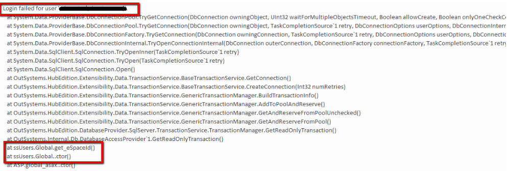

#  How to change the password of OutSystems database users

<div class="info" markdown="1">

This procedure applies only to self managed infrastructures on OutSystems 11

</div>

## Context

The Platform Server requires database users to connect to the Platform, Log, and Session databases. These users are critical in ensuring the functionality of OutSystems components and apps.

Upon the Platform Server installation, the [Configuration Tool](https://success.outsystems.com/Documentation/11/Reference/Configuration_Tool) creates the credentials for the database users.

The Platform Server requires the following database users (the presented users are the default values):

* [Platform database users](https://success.outsystems.com/Documentation/11/Reference/Configuration_Tool/Platform_Tab):
    * Administrator: ```OSADMIN```
    * Runtime: ```OSRUNTIME```
* [Log database users](https://success.outsystems.com/Documentation/11/Reference/Configuration_Tool/Log_Tab):
    * Administrator: ```OSADMIN_LOG```
    * Runtime: ```OSRUNTIME_LOG```
* [Session database user](https://success.outsystems.com/Documentation/11/Reference/Configuration_Tool/Session_Tab):
    * Session: ```OSSTATE```

## Use case

You may need to change the passwords associated with these database users, for example, to comply with password rotation requirements, a common security practice.

## Procedure

This document guides you through the necessary steps and it can be used  to change the passwords of all users or just some of them.

<div class="warning" markdown="1">

This procedure causes a complete loss of service from the moment it's initiated until it's fully completed. Make sure to plan accordingly and read the full procedure before executing it.

</div>

### Steps to execute on the database and on the deployment controller

Start by performing the following steps in the deployment controller server:

1. Open the Configuration Tool and verify the users you wish to change. You can also check there the address of the databases to connect when changing the users passwords. This is an example of the Platform database users:

    

1. Stop all OutSystems services.
1. Connect to each of the databases using the appropriate management tool (for example: SQL Server Management Studio or Oracle Developer) and change the passwords where applicable. Depending on your criteria you may choose to change it only for some users or for all:
    1. Access the Platform database and change the password of the Administrator and Runtime Users (by default ```OSADMIN``` and ```OSRUNTIME```).
    1. Access the Log Database and change the password of the Administrator and Runtime users (by default ```OSADMIN_LOG``` and ```OSRUNTIME_LOG```).
    1. Access the Session database and change the password of the Session user (by default ```OSSTATE```).
1. In the deployment controller server, open the [Configuration Tool](https://success.outsystems.com/Documentation/11/Reference/Configuration_Tool) and change the passwords:
    1. In the corresponding tab (Platform, Log, Session) change the values on the **Password** field for each database user that was altered in step 3. The following image shows an example on the Log tab:

        

    1. On the tabs where the passwords were changed, click **Grant Permissions** (for the Platform and Log tabs) and **Create Session Database** on the Session tab. 
    1. Confirm that the passwords you entered in the Configuration Tool match the ones on the database by clicking on the corresponding the **Test Connection** links on the corresponding tab.
    1. Click **Create/Update Database** and wait for the process to succeed.
    1. Go to File > Export configuration and save the file as 'server.hsconf'.
    1. Click **Apply and Exit**
    1. Choose **Yes** when prompted to restart the OutSystems services.
    1. Click **Yes** when prompted to install Service Center.

### Steps to execute on the front-ends

If the environment is a farm with additional front ends, execute the following steps on the remaining front ends:

1. Copy the 'server.hsconf' file (exported from the deployment controller server on step 4.5 of the previous section) to the Platform Server directory and replace the old server.hsconf file. By default, the Platform Server directory is C:\Program Files\OutSystems\Platform Server. For backup, it's recommended to save a copy of the old file.
1. Stop all OutSystems services.
1. Open Configuration Tool.
    1. In the Network tab, under Front-End Registration, if the Local IP Address option is not set as (automatic), confirm that the IP address belongs to the machine where the Configuration Tool is being run. If needed, fix this by choosing an IP address from the drop-down, choosing (automatic), or typing it manually.
    1. Confirm that the configuration is correct by checking the result of **Test Connection** for each user under Platform, Log, and Session tabs. Additionally, make sure the correct IP address is set on the Network tab under Front-End Registration.
    1. Click on **Apply and Exit**
    1. Choose **Yes** when prompted to restart the OutSystems services.

### Steps to execute on Service Center {#steps-sc}

After changing the passwords on the database and on the Configuration Tool of all OutSystems servers, application artifacts need to be recreated to use the new credentials at runtime.

Access Service Center and apply settings to all the modules of that environment:

<div class="info" markdown="1">

If your infrastructure is using Active Directory(AD) authentication for IT users, it won't be possible to login to Service Center at this point. In that case please execute [this workaround](#AD-workaround) first and only after follow the next 2 steps.
If IT users aren't integrated with an AD, proceed without the workaround.

</div>

1. [Create an all components solution](https://success.outsystems.com/Support/Enterprise_Customers/Maintenance_and_Operations/Creating_and_using_an_%22All_Components%22_solution).
1. On that solution, [click **Apply Settings**](https://success.outsystems.com/Support/Enterprise_Customers/Maintenance_and_Operations/Applying_Configurations_in_Service_Center#Apply_Pending_Settings_to_a_Set_of_Modules).

#### Workaround for Active Directory {#AD-workaround}

It's possible that when you are using AD authentication for IT users, you won't be able to login in to apply Settings to all applications.

As a workaround, AD authentication needs to be temporarily disabled as follows:

1. Open a connection to the environment's Platform database and run the following command:
        
    ```
    update OSSYS_AUTHPROVIDER set ISACTIVE=0 
    where id= (select id from OSSYS_AUTHPROVIDER 
    where name='ADAuthProvider');
    ```

1. Open Configuration Tool in the deployment controller server and click on **Apply and Exit**. Answer **Yes** when asked if you want to install Service Center.
1. Access Service Center and log in using the built-in 'admin' account.
    1. If you can't to log in using 'admin' account, check if it's disabled with the following query on the Platform database:

        ```
        select id,username,IS_ACTIVE from ossys_user where username ='admin' and TENANT_ID = (select id from ossys_Tenant where name='ServiceCenter');
        ```

        This will return only one result, if the value of the column `IS_ACTIVE` is `0`, enable the admin user with the query:

        ```
        update ossys_user set is_Active=1 where username ='admin' and TENANT_ID = (select id from ossys_Tenant where name='ServiceCenter');
        ```

    1. If after enabling the admin user you also need to reset it's password: 
        1. Go the Configuration Tool and access the Credentials tab. 
        1. Fill in the **Password** and **Confirm Password** fields.
        1. Click **Apply and Exit**. 
        1. Choose **Yes** when prompted to restart the OutSystems services.
        1. Answer **Yes** when asked if you want to install Service Center.

1. While in Service Center,  [create an all components solution](https://success.outsystems.com/Support/Enterprise_Customers/Maintenance_and_Operations/Creating_and_using_an_%22All_Components%22_solution) and [click **Apply Settings**](https://success.outsystems.com/Support/Enterprise_Customers/Maintenance_and_Operations/Applying_Configurations_in_Service_Center#Apply_Pending_Settings_to_a_Set_of_Modules).

1. Enable the AD Authentication by running the query:

    ```
    update OSSYS_AUTHPROVIDER set ISACTIVE=1 
    where id= (select id from OSSYS_AUTHPROVIDER 
    where name='ADAuthProvider');
    ```
1. Open Configuration Tool in the deployment controller server and click on **Apply and Exit**. Answer **Yes** when asked if you want to install Service Center.
1. Repeat step 4: create an all components solution and click **Apply Settings**. If there are warnings regarding outdated dependencies after applying the settings, you should republish the all components solution.


## Troubleshooting

### Database login errors in the Event Viewer logs

Usually, during this process, you may identify errors related to failed database logins in the Event Viewer logs. These errors happen when an OutSystems application (Service Center included) wasn't republished yet after changing the database users password. Please check the following example:



A particular module isn't able to establish a connection to the database because the login is failing. This happens because it's still using the old information to login to the database.

Make sure that the settings were applied to all the modules as shown [here](#steps-sc).
