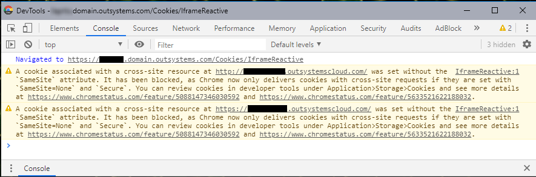
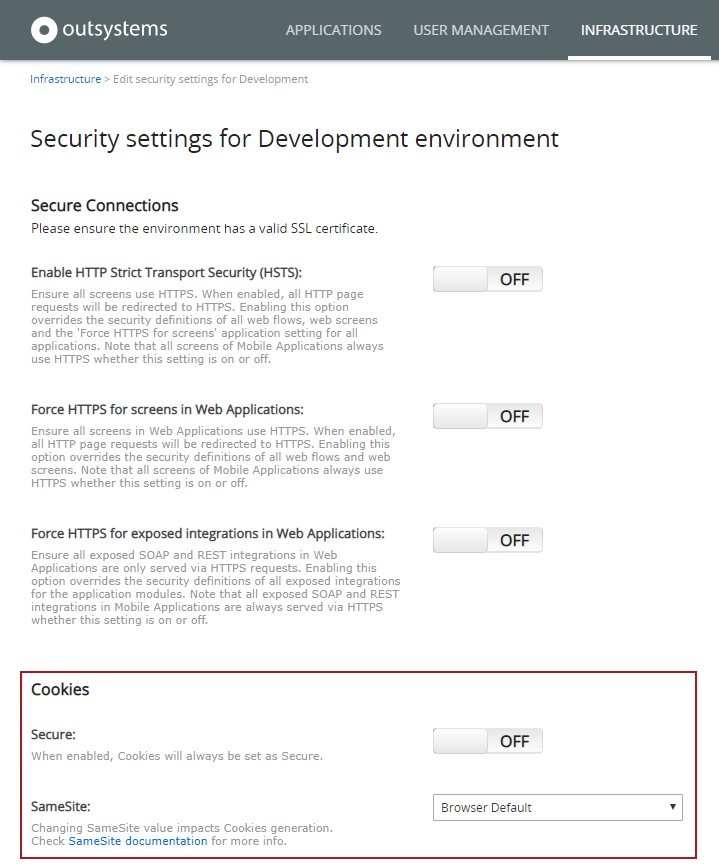

---
summary:
locale: en-us
guid: 5a2750dc-43e6-4404-85c3-413b433c630a
---

# Upcoming changes in cookie handling in Google Chrome 

<div class="info" markdown="1">

**Note:** The changes provided by OutSystems only affect servers that have the [latest changes for .NET Framework 4.7.2 and 4.8](https://docs.microsoft.com/en-us/aspnet/samesite/kbs-samesite) released by Microsoft.

</div>

Google Chrome will [change its default cookie behavior](https://blog.chromium.org/2019/10/developers-get-ready-for-new.html?m=1) in Feb 2020. This change may have an impact in your OutSystems apps if you have third-party integrations or cross-site scenarios. You should evaluate in advance if any of your applications is affected by these changes and, if necessary, install an OutSystems software patch (for on-premise customers) to help overcome any detected issues. For cloud customers, this patch will be scheduled for installation between January 20 and February 7, 2020 and you'll be able to opt out of this update if you don't require it.
 
The patch provided by OutSystems allows you to opt in to a different cookie policy, less secure than the default one, that affects all cookies generated by the OutSystems platform itself. You should only opt in to this policy if required by your applications and third-party integrations.

Other browsers like Firefox and Edge are also planning to change the default cookie behavior, but no timelines have been announced so far.

## Same-site vs. cross-site { #same-cross }

To understand the impact that you might have in your applications, it's important that you understand what a "site" is, and what's the difference between "same-site" and "cross-site".

A "site" is the combination of the domain suffix and the part of the domain just before it. For example, consider the following domains:

* `intranet.mycompany.com`
* `extranet.mycompany.com`
* `www.mycompany.com`

All these domains belong to the **same** site. They share the domain suffix ("com") and the part of the domain just before it ("mycompany").

Note that the "domain suffix" part might contain more than just the top level domain (e.g. "com").   
There's a [public suffix list](https://publicsuffix.org) that makes the following domains belong to different sites:

* `johndoe.outsystemscloud.com`
* `maryjane.outsystemscloud.com`

They belong to **different sites** because there's a public "outsystemscloud.com" domain suffix. Although they have the same domain suffix ("outsystemscloud.com"), they don't share the part of the domain just before it ("johndoe").

Requests made at a given site to resources available in a different site, according to the "site" definition stated above, are considered **cross-site requests**. This happens with iframes displaying content from a different site. On the other hand, all requests made to the current site are considered **same-site requests**.

<div class="info" markdown="1">

Same-site requests will not be affected by the upcoming cookie changes announced by Chrome.

</div>

See [Google documentation](https://web.dev/samesite-cookies-explained/) for details and more examples.

## Examples of affected scenarios

There are several scenarios that might be affected by the cookie behavior changes. In this document we're going to analyse the following scenarios in the context of OutSystems:

* OutSystems apps with iframes displaying third-party content
* Third-party sites with iframes displaying OutSystems screens/content
* OutSystems apps with iframes displaying OutSystems screens/content
* OAuth/OpenID/SAML authentication flows using cross-site requests
* Custom cookies set in JavaScript

Check [Google documentation](https://web.dev/samesite-cookie-recipes/) for additional examples and for more information on this subject. 

### OutSystems apps with iframes displaying content from 3rd-party sites { #iframes-other }

If your OutSystems applications use iframes to display content from third-party sites, you may run into issues if those content providers require cookies to maintain session state or display personalized content.

To overcome this issue, **the third-party content provider must implement some required changes on his side**.

No changes should be necessary on the OutSystems side as long as communications to the provider are already being made over the HTTPS protocol. However, if these communications are still being done using the HTTP protocol instead of HTTPS, **you must change your OutSystems application**. The changes that the third-party provider will have to do require that cookies have the `Secure` attribute, and these cookies are only sent over the HTTPS protocol.

### Third-party sites with iframes displaying OutSystems screens/content { #iframes-outsystems }

You will face issues in most cross-site scenarios, apart from simple cross-site GET requests with no interactions and that don't require authentication (check [Same-site vs. cross-site](#same-cross) above).
Any iframes displaying OutSystems pages must be able to send cookies, since there are always mandatory cookies for authentication and security validations.

To make sure that the OutSystems content works properly when embedded in a third-party site, you must have the new OutSystems patch installed and set the new "SameSite" setting to **"None"**, so that the platform-generated cookies include the `SameSite=None` attribute. Check [About the SameSite attribute](#samesite-attribute) for more information on this attribute and the meaning of the "None" value.

Additionally, since these cookies must also be marked as `Secure`, you must have the "Force HTTPS for Screens" setting enabled at the environment level, and the URL of the iframe where the OutSystems content is being embedded must use the HTTPS protocol. 

You must also make sure that **you're using the latest version of OutSystems UI Web and Silk UI Web**. See the next section for details.

### OutSystems apps with iframes displaying OutSystems screens/content { #iframes-outsystems-ui }

If you're using an iframe in an OutSystems application to display OutSystems content you must ensure that you have the latest version of the following components:

* For **OutSystems 10**: Latest version of [Silk UI Web](https://www.outsystems.com/forge/component-overview/916/silk-ui-web)
* For **OutSystems 11**: Latest version of [OutSystems UI Web](https://www.outsystems.com/forge/component-overview/4143/outsystems-ui-web) and [Silk UI Web](https://www.outsystems.com/forge/component-overview/916/silk-ui-web) (if you're still using Silk UI Web in your applications)

### OAuth/OpenID/SAML authentication flows using cross-site requests { #oauth-flows }

Some authentication flows of OAuth/OpenID/SAML use POST requests instead of GET redirects to complete the authentication process. When using POST requests, the last request will not include cookies, since it's a cross-site request (check [Same-site vs. cross-site](#same-cross)), which will prevent the authentication process from finishing properly. 

This kind of requests is one of the main reasons why Chrome is changing the default behavior of cookies. Therefore, we cannot recommend you to opt in to the new cookie policy (by setting the "SameSite" setting to "None") to enable this authentication scenario.

Instead, OutSystems recommends that you **change to a different authentication flow that does not require cross-site cookies in POST requests to work properly**. Most Identity Providers (IdPs) have multiple flows available for developers to choose from.

### Custom cookies set in JavaScript { #custom-cookies-javascript }

Sometimes you need to set cookies in client-side JavaScript code, for example, to keep a more persistent state. If your application is used in cross-site scenarios and it sets cookies using the platform's JavaScript extensibility (i.e. you're setting cookies using "document.cookie = "), you will face issues when reading those cookies in those scenarios.

In this case, to avoid problems with incompatible browsers, OutSystems recommends that you **define two cookies with different names**: one with "`;SameSite=None; Secure`" and another one with just "`;Secure`".

Example:

```javascript
document.cookie = 'mycookie=value; SameSite=None; Secure';
document.cookie = 'mycookie-legacy=value; Secure';
```

You must also change the code that reads the previously existing cookie to do the following:

1. Try to read the cookie with the `SameSite` attribute set. 
1. If the cookie is not available, read the other cookie, which doesn't have that attribute.

This makes your application compatible with all browsers, without having to make decisions based on user agent strings. This recommendation is aligned with the approach proposed in [Google's documentation](https://web.dev/samesite-cookie-recipes/#handling-incompatible-clients) on how to handle incompatible clients.

Although these changes don't require any OutSystems patch, **you must change your OutSystems applications to set and read the two cookies when necessary**, and then test them to make sure that you get the correct behavior.

## Checking if you'll be affected

To make sure your applications are prepared for the upcoming changes, you should activate two Chrome feature flags and test your application under the upcoming cookie handling behavior, to be released in Chrome 80. You should also test the behavior of any custom cookies you might be using. These Chrome feature flags are available in Chrome 76 or later.

Do the following:

1. Open Chrome and navigate to the following address: `chrome://flags`
1. Enable the following experimental features by changing the feature flag values from "Default" to "Enabled":
    * **"SameSite by default cookies"**
    * **"Cookies without SameSite must be secure"**
1. Restart Chrome and open your application again.
1. Test the behavior of your application, checking if anything stopped working properly. Make sure that your tests include:
    * Authentication scenarios
    * Pages displaying embedded content from third-party providers (if any)
    * Typical actions for the main features of the application

If you find any issues in your applications, namely in any of the scenarios mentioned above, do the following:

1. While still in Chrome, open Chrome Developer Tools.
1. Check the console, at the bottom of the window, for any warnings related to cross-site cookies.

When the feature flags are enabled, you will probably get warnings in the Chrome Developer Tools' console about cookies, stating that some of the cookies were **blocked** due to the lack of `SameSite=None` and `Secure` attributes. This simulates the new cookie-handling behavior of Chrome 80, and this new behavior might be causing the issues in your application.

In the following image, you can see some console warnings when opening an application screen with an iframe. The image comes from a test using Chrome 76 with the two feature flags enabled:



To check if the new cookie behavior is in fact the root cause of the issues, you can either disable the feature flags in Chrome and test the app again, or you can test it in a different browser.

Note: Due to a [bug in Chrome](https://bugs.chromium.org/p/chromium/issues/detail?id=1027318), you will get some warnings about subdomain cookies that are not used in the page. Pay attention to the cookies mentioned in these warnings, since they may be irrelevant to the issues you're analyzing. This bug will only be fixed in Chrome 80, the same version where the new cookie handling behavior will be released.

## What's included in the OutSystems patch? { #patch }

For **OutSystems 11**, the patch allows you to configure the default value of the [SameSite attribute](#samesite-attribute) for the cookies generated by the platform in the new "SameSite" setting.

In the new **"SameSite" setting** in LifeTime you can select one of the following values:

* **Browser Default** – Uses the browser default handling, i.e. the `SameSite` attribute will not be included in platform-generated cookies.
* **None** – platform-generated cookies will include the `SameSite=None` attribute. 

There's also a new **"Secure" setting** in the same configuration screen. Activating this option will add the `Secure` attribute to all cookies generated by the platform.



<div class="info" markdown="1">

_Note:_ When you set the "SameSite" setting to "None" you must also enable:

* The new **"Secure"** setting
* At least one of following two settings: **"Enable HTTP Strict Transport Security (HSTS)"** or **"Force HTTPS for Screens in Web Applications"**. 

Check [Enforce HTTPS Security](https://success.outsystems.com/Documentation/11/Managing_the_Applications_Lifecycle/Secure_the_Applications/Enforce_HTTPS_Security) for more information on these settings.

</div>

The [SetCookie action](https://success.outsystems.com/Documentation/11/Reference/OutSystems_APIs/HTTPRequestHandler_API#SetCookie) of the HttpRequestHandler extension has new optional input parameters allowing you to specify "SameSite" and "Secure" values for specific cookies. If you don't specify values for these input parameters, the generated cookies will follow the value of the platform-wide setting.

For **OutSystems 10**, the patch adds support for the SameSite cookie configurations, but there are no new settings in LifeTime. You can configure the SameSite behavior using [Factory Configuration](https://www.outsystems.com/forge/component-overview/25/factory-configuration).  
Since in OutSystems 10 you will need to republish your factory to apply this SameSite configuration change, we recommend that you configure this setting right after installing the patch so that you only need to perform the republish once.

Additionally, the SetCookie action of the HttpRequestHandler extension did not change in OutSystems 10. This action follows the platform-defined configuration for cookie behavior (which you can set up using Factory Configuration), but you cannot customize the `SameSite` and `Secure` attributes per cookie.

**The behavior of the platform remains the same unless you change these configurations.** This means that, by default, the platform does not specify any `SameSite` attribute value in platform-generated cookies. In this case, browsers may issue some false-positive warnings, but apps will still work properly on all browsers that keep their current default cookie-handling behavior (i.e. browsers that allow cookies in cross-site requests). 

In a future version, after the major browsers have rolled out this new cookie-handling behavior and based on the results, OutSystems will review the defaults and consider the possibility of adding "Lax" as a configurable value for the "SameSite" setting.

## Release schedule

### For cloud customers

If you're a cloud customer, you'll be contacted by OutSystems to schedule the platform update, which will occur between **January 20** and **February 7**. You can opt out from this update if you have not identified any issues in your apps.

### For on-premises customers

OutSystems released the following patches for Platform Server 11:

* Platform Server 11 Release Oct.2019 CP6
* LifeTime Management Console Release Dec.2019

OutSystems also provided a new release of Platform Server 10 — version 10.0.1021.

Microsoft also [released a patch for .NET Framework](https://docs.microsoft.com/en-us/aspnet/samesite/system-web-samesite) related to the changes in the cookie-handling behavior in Chrome. Check the [available KB articles for your operating system version](https://docs.microsoft.com/en-us/aspnet/samesite/kbs-samesite).  
The Microsoft patch should be installed after the Platform Server patch and after republishing your OutSystems applications, since the Microsoft patch contains breaking changes in session cookie handling.

If you do not require the new opt-in capability of setting the `SameSite=None` attribute in platform-generated cookies because you didn't identify any issues in your applications, you don't need to install the .NET Framework patch or the OutSystems provided patch. 

_Note:_ OutSystems will not change the version of the .NET Framework platform requirement due to this Microsoft patch.

## The technical bits

### About the SameSite attribute { #samesite-attribute }

You can include the `SameSite` cookie attribute when setting a new cookie.
This attribute accepts three different values, with the following meanings:

* **Strict** – Third-party cookies are not allowed. Clicking on links to other sites does not send cookies either.
* **Lax** – Third-party cookies are not allowed. However, cookies are sent when the user clicks a link to another site.
* **None**\* – Keeps the old behavior. However, the third-party site must use HTTPS and the cookie must be marked as `Secure`.

When this attribute is **not defined**, currently all browsers allow cookies in cross-site requests. 

\* The "None" value was proposed recently, and some older browsers are incompatible with this value. Some of them might accept cookies with this attribute value, while others might block it. While this is handled automatically on platform-generated cookies, we recommend that you check the proposed workaround for this issue in the [Custom Cookies set in JavaScript](#custom-cookies-javascript) section.

### What's changing in Chrome

Chrome is going to change the default behavior of cookies that currently don't specify the `SameSite` attribute. From Chrome 80 onward, the default setting for cookies that don't specify the `SameSite` attribute will be `SameSite=Lax`.

This means that these cookies **will not be sent** if the destination site does not match the domain that is being accessed in the browser. This will also force any third-party providers that require cross-domain integrations to: 1) specify the `SameSite=None` attribute in cookies to declare their intent, 2) Specify the cookie as `Secure`, and 3) use HTTPS connections.

For more information check the [SameSite cookies explained](https://web.dev/samesite-cookies-explained/) topic by Google.

### Cookies affected by the new platform settings

The cookies that are affected by the new "SameSite" and "Secure" OutSystems settings are the following:

* Internal cookies set by the platform (for example, for session handling)
* Cookies set using the SetCookie action from the HttpRequestHandler extension 

All cookies set through these methods will create cookies according to the values of the new settings.

Any cookies generated in the following cases **do not** automatically comply with the platform-defined configurations:

* Cookies set in JavaScript code
* Cookies set in Extensions

In these cases, you must make sure that you set all the correct attributes when defining the cookies. For cookies set in JavaScript, check [Custom Cookies set in JavaScript](#custom-cookies-javascript).
