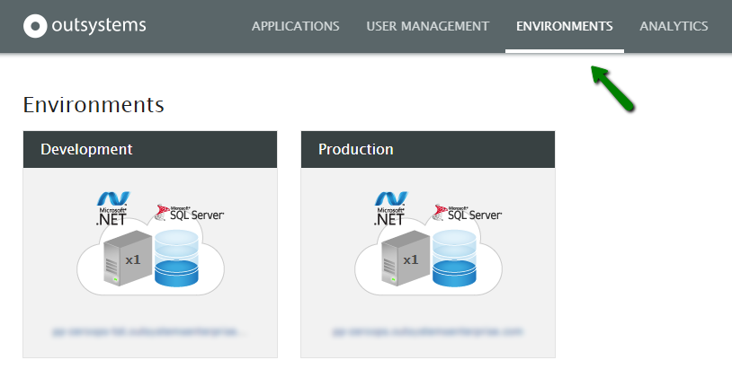
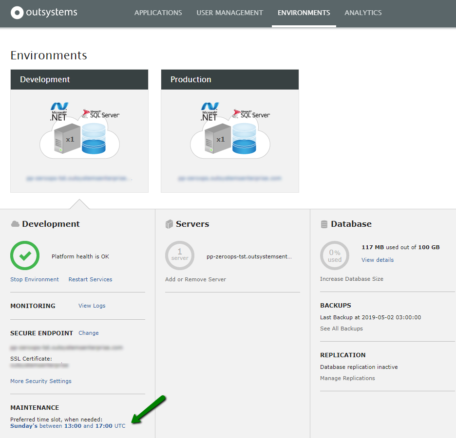
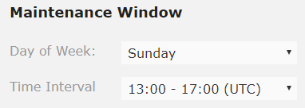

# Define a maintenance window for OutSystems Cloud environments

## What is a maintenance window?

The maintenance window is a feature offered on OutSystems Cloud subscriptions, in which customers can set up a time window used by OutSystems operations team to perform maintenance task when needed. OutSystems uses the same hour of the maintenance window to daily execute the database maintenance plan, to ensure an optimal database health and performance.

Some operations, will cause downtime during the selected time period. In this case, the administrator(s) will be informed before the operation is performed.

## Define the maintenance window for an environment { #define-maintenance-window }

OutSystems sets the maintenance window for your OutSystems Cloud environments when they are created. However, you can configure the maintenance of your Cloud environments for a time window that better fits you:

* **Non-production and LifeTime environments**: These environments will have the same maintenance window since they are sharing the same database. When configuring a maintenance window for a non-production environment, **it will be applied to all the remaining non-production and LifeTime environments**.

* **Production**: You can configure a different maintenance window for the production environment.

To configure the maintenance window for an environment in OutSystems Cloud, follow the steps below:

1. Access your **LifeTime console**.

1. Click the **Environments** tab.

    

1. Click the environment to which you want to configure the maintenance window.

1. Click the link with the current maintenance window.

    

1. Select the **Day of Week** and the **Time Interval** that better fits. Note that Time Intervals apply only to business days and the time is in **UTC**.

    

    If you are defining the maintenance window for a **non-production** environment, it will be applied to all the **remaining non-production** and **LifeTime** environments.

1. Click **Save**.

The maintenance window is now configured. Any maintenance tasks related to the environment will be scheduled within the specified time frame.

## Maintenance window for the LifeTime environment

The maintenance window for your LifeTime environment **is the same configured for your non-production Cloud environments** since they are sharing the same database.

If you want to define the maintenance window for your LifeTime environment, you must configure that maintenance window for one of your non-production Cloud environments by following the steps in [Define the maintenance window for an environment](#define-maintenance-window).
