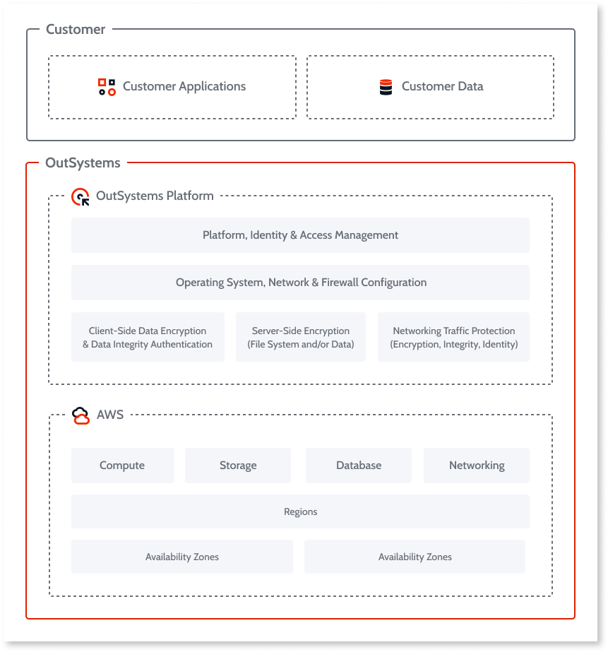

# OutSystems Cloud Shared Responsibility Model

OutSystems allows the development of enterprise web and mobile applications that run in different infrastructure models:

* **OutSystems cloud**: deployed on Amazon Web Services (AWS) and managed by OutSystems

* **Customer-managed**: including on-premises, public, and private cloud

When activating a subscription, and depending on infrastructure choice, all environments are deployed to either the OutSystems cloud or the customer-managed infrastructure.

Learn more in [Possible setups for an OutSystems infrastructure](https://success.outsystems.com/Documentation/11/Setting_Up_OutSystems/Possible_setups_for_an_OutSystems_infrastructure?utm=training).

## Shared Responsibility Model

In the OutSystems Cloud, OutSystems shares control of the cloud environments with you. Although OutSystems provides secure and compliant services to protect customer data and applications, you are solely responsible for properly configuring and operating those services as required by your organization.  

This approach relieves you of the operational burden as OutSystems operates, manages, and controls the components from the platform down to the infrastructure as explained in the following diagram.

OutSystems uses several layers of defense to prevent various types of threats and achieve compliance with security frameworks such as  SOC 2, SOC 3, PCI-DSS, and ISO 27001 without compromising application performance. 

The following sections explain the shared responsibilities between OutSystems and its customers.

## Customer responsibilities

OutSystems customers are responsible for securing data and user access/permissions to their applications. Customers are responsible for the management of their applications throughout the entire lifecycle; from when it is developed to when it is deployed to production. Ultimately, OutSystems Cloud customers are responsible for:

* Managing their data (including encryption options), classifying their assets, and using Identity and Access ManagementAM tools to apply for the appropriate permissions.

* Applying secure development techniques and conducting code security reviews on developed applications.

* Identifying application vulnerabilities through vulnerability assessments and penetration testing.

* Mitigating application vulnerabilities and associated risks.

## OutSystems Responsibilities

OutSystems is responsible for protecting the infrastructure that runs all of the services offered in the OutSystems Cloud. This infrastructure is composed of the hardware, software, networking, and facilities that run OutSystems Cloud services. OutSystems is responsible for the following:

* **Platform security**. OutSystems provides its customers computing platform for designing, building, deploying, and managing business applications. OutSystems implements many layers of security defense architecture to resist various types of threats and ensure the entire computing platform. OutSystems responsibility is to protect the business values of its customers' applications while helping them to achieve compliance with industry security frameworks and standards.
Identity and access management: OutSystems integrates with Active Directory and Single-Sign-on to allow customers to manage the access controls as they would for any enterprise software. OutSystems offers its customers the capabilities to define, enforce and manage individual user accounts with permissions across its services.

* **Operating systems, network & firewall configuration**. OutSystems is responsible for configuring and deploying the underlying operating systems, network components, and firewalls that supports customers' developed and managed applications. OutSystems implements industry-accepted best practices to harden its network security as a practice of reducing system vulnerability by reducing its attack surface. OutSystems deploy security infrastructure for comprehensive monitoring of its environments using the following tools:

    * Intrusion Detection Systems
    * Logging and Alerting Systems
    * Vulnerability Scanning
    * Perimeter Monitoring
    * Patch Management, and
    * Security Incident Monitoring
    
* **Encryptions**. OutSystems platform offers the ability to add a layer of security to customers' data at rest in the cloud. OutSystems is responsible for providing customers the capabilities for encrypting data at rest and in transit, allowing customers to satisfy their security compliance requirements.

* **Compute/Storage/Database/Networking**. OutSystems delivers hardware and software tools to its customers over the internet. Therefore, OutSystems is responsible for managing the underlying infrastructure such as servers, storage, database management systems, and networking resources that supports its customers complete application lifecycle: developing, testing, deploying, managing, and updating.  

* **Availability Zones & Regions**. OutSystems is responsible for managing remote data center infrastructures such as computing environments, data storage, and network resources. OutSystems performs replication at each datacenter (availability zones/region), annual disaster recovery tests for the service to verify the project recovery times. OutSystems ensures customer data between datacenters are performed through encrypted channels. OutSystems ensures its customers' applications inherit cloud characteristics such as scalability, high-availability, multi-tenancy.

OutSystems communicates its cloud security and controls in a number of different ways:

* Obtaining industry certifications and independent third-party attestations;

* Publishing information about OutSystems security and control practices;

* Providing [trust certificates and reports](https://security.outsystems.com/), and other documentation to OutSystems customers, some of them under NDA (as required).

Refer to OutSystems [ISO 27017 certification](https://security.outsystems.com/?itemUid=0c1fdf36-c946-4670-9354-8fa3e4260ab1&source=documents_card) for details on cloud-specific information security controls, and the shared responsibility model.
