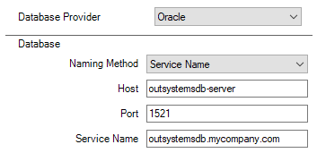
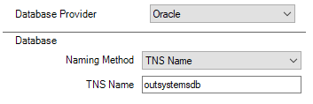
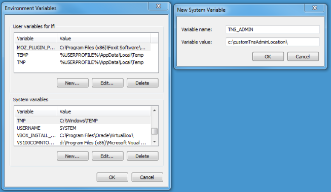
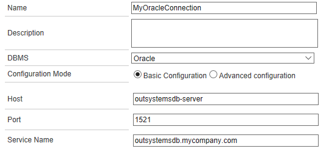
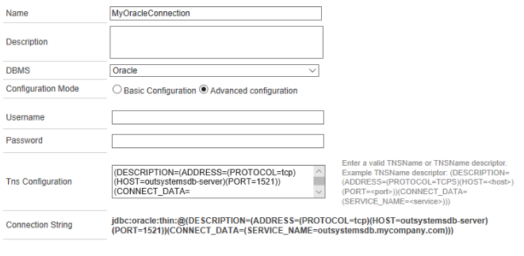
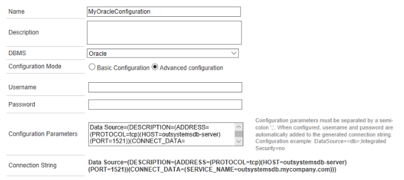

# Configuring Oracle database in the OutSystems platform

This document details the steps needed to configure an Oracle database in the OutSystems Platform Server.

OutSystems supports connections to an Oracle database via service names, either defined explicitly or through TNS syntax (in a tnsnames.ora file or as keyword-values in the driver configuration). The following sections detail the configurations needed for the Java and .NET stacks of the Platform Server.

## Oracle instances and services

### Database Instances

An Oracle database has at least one instance, comprised of memory and background processes, that manage the associated database’s data and serve the database users.

Instances are identified by an instance name, which defaults to the Oracle system identifier (**SID**) of the database instance. As an example, we may have an Oracle database with the SID `outsystemsdb`.

### Database Services

An Oracle database is represented to clients as a service, and one or more services may be associated to a database.

A **service name** is a logical representation of a database. It can identify multiple database instances, and an instance can belong to multiple services. For example, the service `outsystemsdb.mycompany.com` enables the connection to an OutSystems database.

To connect to a database service, clients may use a **connect descriptor** that provides the location of the database and the name of the database service. A connect descriptor is comprised of one or more protocol addresses of the listener and the connect information for the destination service.

As an example of a simple connect descriptor, we may have the following in a tnsnames.ora file:
```
outsystemsdb=

 (DESCRIPTION=

   (ADDRESS=(PROTOCOL=tcp)(HOST=outsystemsdb-server)(PORT=1521))

   (CONNECT_DATA=

       (SERVICE_NAME=outsystemsdb.mycompany.com)))
```
## Configure Oracle in OutSystems Platform

The database used in the OutSystems platform is configured via the Configuration Tool. It is also possible to define external database connections to be used in extensions, which are configured in Service Center.

### Configuration Tool

After selecting Oracle as Database Provider, the Naming Method must be selected: Service Name or TNS Name.

#### Service Name

When using the "Service Name" naming method you must fill in the following parameters:

* Host: the name or IP of the database server;

* Port: the TCP port number in which the database listens to. The default value for Oracle is 1521;

* Service Name: string that represents the service name of the Oracle database that you want to connect to.

**.NET stack**



**Java stack**
```
===== OutSystems Platform Database =====

Database Provider:

 1 - MySQL

 2 - Oracle

 Your choice []: 2

Configuration Mode:

 1 - Basic Configuration

       Allows to configure the Host, Port, and Service Name.

 2 - Advanced Configuration

       Allows using TNS configuration.

       Change the TNS configuration file at '/etc/outsystems/tnsnames.ora' to include the chosen TNS name.

 Your choice []: 1

=== Database Location ===

Host []: outsystemsdb-server

Port []: 1521

Service Name []: outsystemsdb.mycompany.com
```

#### TNS Name

By selecting the "TNS Name" naming method it is possible to configure a connect descriptor via a tnsnames.ora file and then use the net service name in the tool (in the TNS Name field).

**.NET stack**



**Java stack**
```
===== OutSystems Platform Database =====

Database Provider:

 1 - MySQL

 2 - Oracle

 Your choice []: 2

 

Configuration Mode:

 1 - Basic Configuration

       Allows to configure the Host, Port, and Service Name.

 2 - Advanced Configuration

       Allows using TNS configuration.

       Change the TNS configuration file at '/etc/outsystems/tnsnames.ora' to include the chosen TNS name.

 Your choice []: 2

=== Database Location ===

Applications TNS Name: outsystemsdb
```

In Windows, the tnsnames.ora file must be located in the path defined by the `TNS_ADMIN` system environment variable.



In Linux, for the OutSystems Java stack, the tnsnames.ora file must be located in `/etc/outsystems`.

For details about the connect descriptor format, please refer to the [Oracle documentation](https://docs.oracle.com/en/database/oracle/oracle-database/12.2/netrf/local-naming-parameters-in-tnsnames-ora-file.html).

### External Database Connection

External database connections are used by extensions for integration with external databases. These are defined in Service Center in Administration > Database Connections.

The steps to configure an external database connection are similar to the ones described before.

To connect via a Service Name, select Basic Configuration.



By selecting Advanced Configuration it is possible to define the TNS configuration explicitly in Service Center, and there's no need to use tnsnames.ora files.

**.NET Stack**

In the OutSystems .NET stack, the TNS configuration must follow the ADO.NET driver syntax:


**Java Stack**

In the OutSystems Java stack, the TNS configuration must follow the JDBC driver syntax:



 

## Connecting to databases using SID

To connect the OutSystems platform to an Oracle database instance using the SID, use the TNS Name configuration. The connect descriptor is similar as the one described previously, but should be adapted to reflect the database configuration using SID.

Considering the same example above, the tnsnames.ora file should changed to contain the database SID:
```
outsystemsdb=

 (DESCRIPTION=

   (ADDRESS=(PROTOCOL=tcp)(HOST=outsystemsdb-server)(PORT=1521))

   (CONNECT_DATA=

       (SID=outsystemsdb)))
```

If an external database connection is using an Oracle database using SID, the Advanced Configuration should reflect this by with the appropriate connect descriptor:



 

