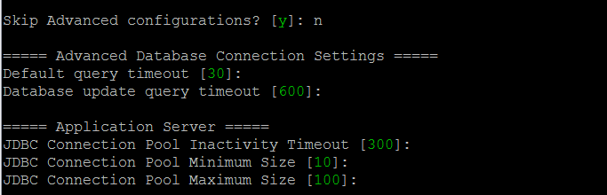

# Connection pools in the OutSystems platform

Database connection pools is one way OutSystems enforces rules to optimize your applications scalability and performance. With connection pools, applications don't open and close database connections. Instead, applications request a connection and return the connection to the pool when it's done.

Using connection pools you avoid the performance overhead of opening and closing database connections. A  new connection only opens if there is no available connection in the pool. Connections close after they're idle for a given period.

For each database connection you define for a database server or schema, OutSystems creates a connection pool to manage that connection.

The same mechanism and principles are used by the Platform Server across all types of applications (traditional web, mobile and reactive).

## Connection pooling under the hood

The platform uses standard connection pooling mechanisms:

* .NET stack - [ADO.NET](https://msdn.microsoft.com/en-us/library/8xx3tyca(v=vs.100).aspx)

* Java stack - [Oracle UCP](http://docs.oracle.com/cd/B28359_01/java.111/e10788/intro.htm#BABHFGCA)

## Controlling the number of connections

You can fine-tune the minimum and maximum number of connections available on the pool.

### .NET Stack

In the **Configuration Tool** you can [customize the connection string](https://success.outsystems.com/Documentation/11/Reference/Configuration_Tool/Platform_Tab/Platform_Tab_in_Azure_SQL_Database_%2F%2F_SQL_Server_database) used by the applications at runtime. For this, go to the '**Database**' tab, and choose '**Advanced**'. Check the documentation of your database server to learn what parameters to send in the connection string.

## Java Stack

In the **Configuration Tool**, you can control the number of connections in the '**Advanced Configurations**'.

The values in square brackets are the default for that setting.

## Minimum connections used at runtime

### .NET Stack

On the .NET stack, there is one connection pool per database server per application module. At runtime you typically have

(minimum number of connections configured) x (application modules) x (front-end servers)

As an example, if you have:

* 1 connection configured by default;
* 10 application modules deployed;
* 2 front-end servers.

You'll typically have 20 connections to the main database and 20 connections to the session database. Starting on OutSystems 11 you'll also have an additional 20 connections to the log database.

### Java Stack

On the Java stack, you have a single connection pool for all application modules. So you typically have

(minimum number of connections configured) x (front-end servers)

As an example, if you have:

* 10 connection configured by default;
* 10 application modules deployed;
* 2 front-end servers

You'll typically have 20 connections to the main database, and 20 connections to the sessions database.

## Maximum connections used at runtime

To make your applications run smoothly under heavy load, the OutSystems platform increases the number of database connections used. The maximum number of connections can be calculated as above, but replacing the minimum number of connections by the maximum number.

## Real-world example

To better understand how OutSystems handles database connections, analyze what happens in a typical production environment with the following configurations. We'll be using the default values for the connection pool, and assume the Sessions and Main database schemas are stored on the same database instance.

|                     | .NET | JAVA |
|---------------------|------|------|
| Front-end servers   | 2    | 2    |
| Application modules | 200  | 200  |
| Min. Connections    | 1    | 10   |
| Max. Connections    | 100  | 100  |

### .NET Stack

On the .NET stack, the application modules are not automatically loaded. Instead, they are loaded on their first access. This means that initially you only have a handful of application modules loading up, and therefore very few database connections.

Assuming that all application modules are eventually loaded:

* You have 200 application modules on each front-end;

* Each of these application modules has one connection for each database the application module connects to. As a minimum, it connects to the OutSystems session and main databases, up until OutSystems 10. Starting on OutSystems 11 it will additionally connect to the log database.

This adds to a total of 800 connections up until OutSystems 10 or 1200 connections for OutSystems 11.

The numbers on the following examples are based on OutSystems 11:

On a high-demand scenario, if there are 50 concurrent user accesses to an application module on each front-end:

50 concurrent users require approximately:

* 50 connections to the session database;
* 50 connections to the main database.

Note that:

* The number of connections in the log database doesn't scale with the number of concurrent user accesses. It will increase based only on how many types of logs need to be written concurrently.

* The numbers are an approximation only because one user session might require more than one database connection: the platform will perform optimizations that might mean that in an action flow more than one connection is used.

One connection was already established on each front-end for each database, so we'll need additional 49 connections per front-end for the session and main databases. This adds up to a total of 1396 connections:

``1200 idle connections + (49 connections per frontend x 2 frontends x 2 database connections per frontend)``

If that application module becomes even more popular and now receives 150 concurrent requests on each front-end:

* This value exceeds the maximum number of connections configured;
* Only the first 100 requests are answered concurrently;
* The other 50 requests on each front-end server will have to wait for a connection to become available. If this takes too long, the request will timeout.

Throughout this peak, the database will have:

* The minimum 1200 connections open;
* 99 connections per front-end server for the session and main databases, a sub total of 396 connections.
This adds up to a total of 1596 connections.

### JAVA Stack

In both the JBoss and WebLogic application servers all application modules are loaded when the application server starts. After the initialization, there are 10 connections per database per front-end. At a minimum, there are the session and main databases. This gives a total of 40 database connections.

On a high-demand scenario, if an application module receives 50 concurrent requests on each front-end:

* Each of the connection pools to the session and main databases is shared between all application modules. It's likely that some of 10 initial connections are being used by other application modules;

* If only 5 of those connections are free, we'll need 45 connections per database per front-end.

This gives a total of 220 connections.

If that application module becomes even more popular and now receives 150 concurrent requests on each front-end:

* Assuming we still have 5 free connections;

* We can create another 95 connections before reaching the maximum configured. This creates a total of 190 connections per front-end server;

* The remaining 55 requests have to wait for an available connection.

During this high-usage peak, there's a total of 400 connections.

### More Information

[This information was initially posted on the Community Forums](https://www.outsystems.com/forums/discussion/15171//).
