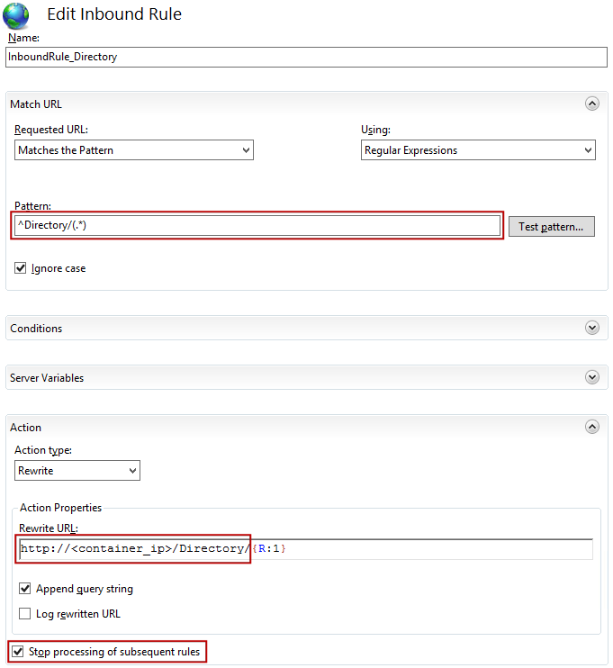
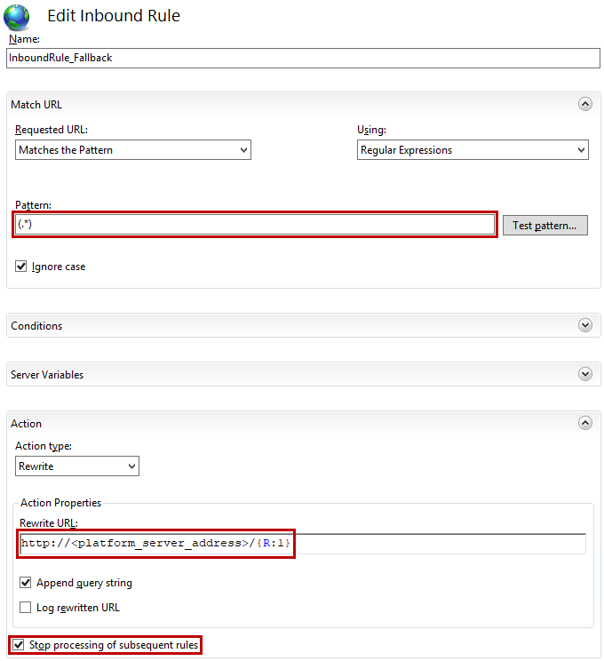

# Docker Containers: Configure Routing Rules in IIS

**Note:** Make sure that you meet the [systems requirements](<https://success.outsystems.com/Support/Archive/11/OutSystems_Platform_system_requirements#Docker_Containers>) and [network requirements](<https://success.outsystems.com/Support/Archive/11/OutSystems_network_requirements#Containers_considerations>) for deploying to Docker Containers.

During the process of deploying an application to Docker Containers (detailed steps available in [Deploying an Application to a Docker Container](<https://success.outsystems.com/Documentation/11/Managing_the_Applications_Lifecycle/Deploying_to_Containers/Running_Your_Application_in_a_Container/Deploying_an_Application_to_a_Docker_Container>)), you will build and instantiate a Docker image. 

After this step, you will need to make sure that the application inside the container is accessible through its configured deployment zone address and through the same public address of your Platform Server. 

In this example, we will leverage as a simplified **main load balancer and reverse proxy** the Internet Information Services (IIS) running on the machine where the Docker Engine is installed. This means that the environment's `<public_address>` will actually be the same as the `<zone_address>` of the Docker Containers deployment zone.

If you are using another routing or reverse proxy software, follow the general configuration guidelines provided below and adapt the instructions accordingly.

This example presents one of several possible solutions for handling the routing associated with applications running in containers. Be sure to validate your routing configuration with your Network and DevOps teams, but remember that this is **not** a recommended production scenario.

The instructions provided below allow you to define the minimum configurations and IIS routing rules needed to ensure the connectivity:

* Between the OutSystems platform and the example application modules running inside a Docker container
* Between external users and the example application modules running inside a Docker container

## Example: The "Directory" Web Application

We will configure routing rules for a simple application called "Directory" containing two modules: **Directory** and **Employees**. 

Our goal is to make sure that the two application modules are reachable using the configured address for the application deployment zone. Remember that thios address will also be, in fact, the _public address_ for the environment.

So, in this example the two modules **Directory** and **Employees** must be reachable at addresses  [`<public_address>/Directory/`, `<public_address>/Employees/`] and equivalently at
[`<zone_address>/Directory/`, `<zone_address>/Employees/`].

To ensure this, you will configure the IIS running on the same machine where the Docker Engine is installed as a reverse proxy (responding on `<zone_address>`, what will be environment's `<public_address>`) allowing requests to be routed to the Docker container where the application is running.

Take the following steps:

1. Install the [Application Request Routing](https://www.iis.net/downloads/microsoft/application-request-routing) and [URL Rewrite](<https://www.iis.net/downloads/microsoft/url-rewrite>) extensions in IIS. The former allows you to define rule-based routing configurations, while the latter allows you to define rules for implementing user-friendly URLs.

1. _(optional)_ Obtain the **container ID** of your running container, if you don't have this information yet:

        docker ps

    This command will output the status and ID of the container. The ID is the set of 12 hexadecimal characters in the first column of the output:

        >docker ps
        CONTAINER ID        IMAGE               COMMAND            CREATED        
        cca03df45abd        microsoft/iis       "C:\\Docker..."    About a minute ago

1. Get the IP address assigned to your container and take note of it (you will need it later):

        docker inspect --format="{{.NetworkSettings.Networks.nat.IPAddress}}" <container_id>

1. Configure the Application Request Routing proxy settings. 

    1. Open IIS Manager, click on the **server** name, open the "Application Request Routing Cache" module and click the "Server Proxy Settings ..." link on the right sidebar. 

    1. Change your settings to match the ones presented in the following image and then click "Apply" on the right sidebar:

        

        Make sure that:  
        – "Enable Proxy" is **checked**  
        – "Reverse rewrite host in response headers" is **unchecked**  
        – "Preserve client IP in the following header" is set to X-Forwarded-For.

1. In IIS Manager, click on the **site** name and open the "URL Rewrite" module.

1. Click "View Server Variables..." on the right sidebar and add a new entry for server variable `HTTP_X_FORWARDED_PROTO`.

    

    By default, rewrite rules cannot change any server variables unless they are declared in the Server Variables list, and we need to change this variable in the rewrite rules we will create next.  

1. Click "Back to Rules" in the sidebar and create a new rewrite rule like the one presented in the following image. It will add the required proxy protocol-forwarding header to HTTPS requests, since in this example scenario we will be using SSL offloading.  
Click "Add rule(s)..." on the right sidebar and start with a blank rule.  
*Note:* This rule must be the **first one** in the rules list and it will be shared between all modules.

    

    Relevant field values:  
*Match URL* – Pattern: `(.*)`  
*Conditions* – Input: `{HTTPS}` | Type: `Matches the Pattern` | Pattern: `ON`  
*Server Variables* – Name: `HTTP_X_FORWARDED_PROTO` | Value: `https` | Replace: `True`  
*Action* – Action type: `None`

    Click "Apply" at the top of the right panel to create the rule.

1. Create a new blank routing rule for **each module** according to the following image. You will need the container IP address obtained in step 3. Give the rule a name of your choice.

    

    Relevant field values:  
*Match URL* – Pattern: `<module_name>/(.*)`  
*Action*  
– Action type: `Rewrite`  
– Rewrite URL: `http://<container_ip>/<module_name>/{R:1}`  
– "Stop processing of subsequent rules" is **checked**

    Following our example, in this step you would create two routing rules, one for the **Directory** module and another one for the **Employees** module. 

    Click "Apply" at the top of the right panel to create the rule.

1. _(Optional)_ Configure a fallback rule for your **platform server address** like in the image below. This rule is only necessary if the application deployed to a container has dependencies on UI elements of modules being deployed to VMs.  
_Note:_ This rule must be the **last one** in the rules list and it will be shared between all modules.

    

    Relevant values:  
*Match URL* – Pattern: `(.*)`  
*Action*  
– Rewrite URL: `http://<platform_server_address>/{R:1}`  
– "Stop processing of subsequent rules" is **checked**

    Click "Apply" at the top of the right panel to create the rule.
    
1. Check that you can access the modules using the deployment zone address.  
Following our example, check if the modules **Directory** and **Employees** are reachable at addresses `<public_address>/Directory/` and `<public_address>/Employees/`.

_Note:_ You will need to remove the rewrite rules added to IIS if you deploy the application back to the "Global" deployment zone.
