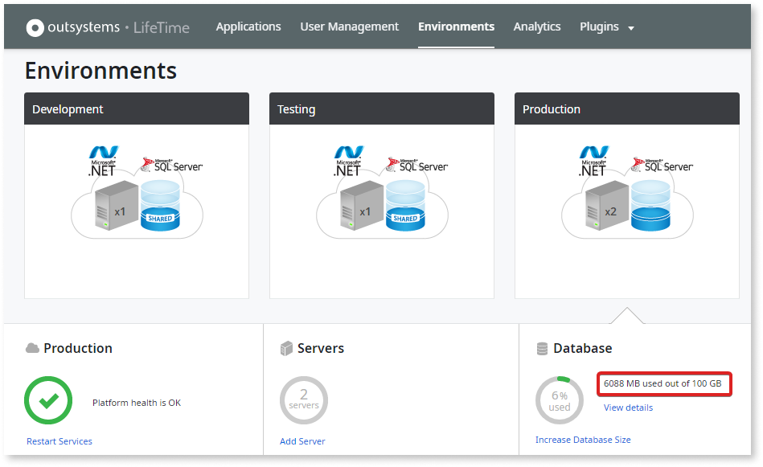
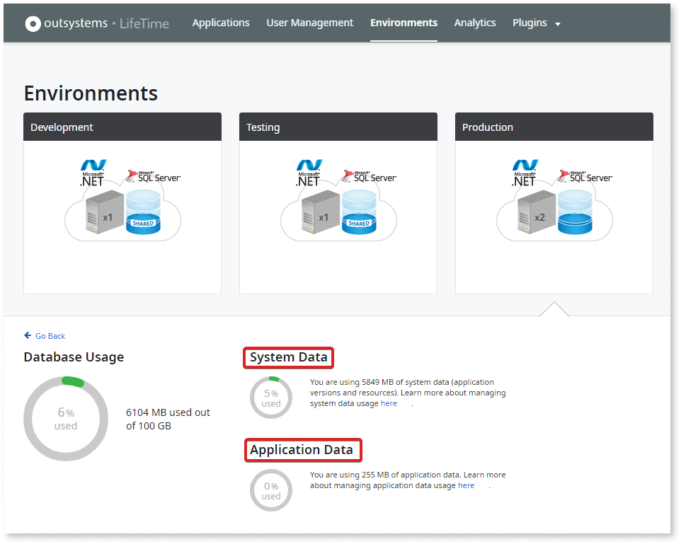

# Database storage on OutSystems Cloud

OutSystems Cloud can run with either SQL Server or Oracle RDS databases. Upon purchase, an initial database storage is provisioned. Storage autogrows as needed.

## What does the value I see in LifeTime mean?

In the **Environments** screen in LifeTime, you can click on an environment card to see the occupied space of each database as well as the total available space.

Starting with LifeTime Management Console 11.25.0, the panel that shows free database space is no longer available for Enterprise PaaS infrastructures. Personal Environments still display this section so that you can check the storage available in the free offer. For Enterprise PaaS environments, rely on your database monitoring tooling or contact OutSystems Support if you need assistance understanding the current allocation.

By clicking on **View details** you can see the breakdown between System and Application data.

**System data** represents the space occupied by OutSystems system tables. This includes:

* Module and solution versions
* Processes
* Emails
* Logs

**Application data** refers to all the information stored in the database Entities of your applications. This includes deleted Entities and Attributes of the data model.

## Should I still clean up space?

It's a best practice that you can execute as you see fit. Regardless, your OutSystems Cloud database space will autogrow if necessary.

For more details on cleaning up space, refer to [Best Practices for a Tidy and Clean Environment](https://success.outsystems.com/Documentation/Best_Practices/Lifecycle/Best_practices_for_a_tidy_and_clean_environment).

## Will my environment ever stop due to lack of database space?

Our health monitoring mechanisms will enable OutSystems to act promptly, safeguarding the robustness of your platform. However, if the consumed storage increases both suddenly and by a large amount, we may not have enough time to react before it starts affecting your platform.

## Can I know how the database space is distributed?

You can do this by querying the database model directly, utilizing the [direct database access](https://success.outsystems.com/Support/Enterprise_Customers/Maintenance_and_Operations/Access_the_database_of_your_PaaS) provided by OutSystems.
