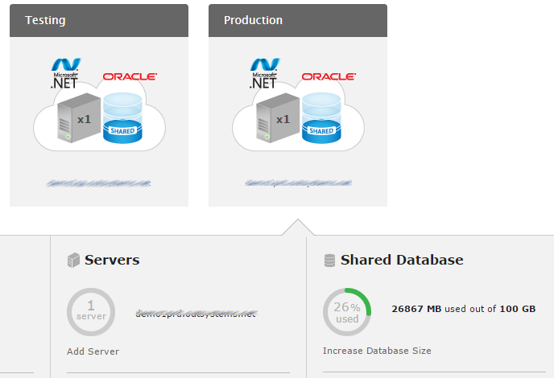

---
summary:
---

# Database storage on OutSystems public cloud

OutSystems Cloud now autogrows database storage as needed at no additional charge. Parts of this document are outdated. We're working to have this article updated.

OutSystems public cloud offers run on either SQL Server or Oracle RDS databases. When a customer purchases the platform, it does so with an initial database storage size. Storage can be increased if needed, up to a limit; after the storage has been increased, it can no longer be decreased.

Please refer to the topics below for more context:

* [OutSystems public cloud services overview](https://www.outsystems.com/evaluation-guide/outsystems-cloud-services-overview)

* [OutSystems public cloud architecture](https://www.outsystems.com/evaluation-guide/outsystems-cloud-architecture/)

## How is storage managed? What does the value I see in LifeTime mean?

OutSystems uses Amazon RDS databases (Oracle or SQL Server). The storage customers get in the OutSystems cloud is the same that OutSystems then reserves in RDS.

OutSystems shows the storage usage based on Amazon RDS usage metrics. This means that this value does not reflect actual data in user tables or the platform system tables - it has overheads of two types:

* Introduced by the database technology (Oracle or SQL Server)

* Introduced by Amazon RDS.

### Overhead introduced by the database technology (Oracle or SQL Server)

Databases don't just store your data. They store control data, information on the model, etc. This means the size of a database will be bigger than the size of the data you store in it - how big depends on the actual use you are giving it.

Additionally, databases sizes grow as you add data to them, but don't necessarily shrink when you delete data from them. Best practices dictate that used storage should not be shrunk to optimize performance in databases; OutSystems follows such best-practices.

### Overhead introduced by Amazon RDS

Amazon RDS introduces overhead due to internal use (log files, transaction logs, etc). If you want to find out more about how RDS space is managed, please refer to the Amazon documentation:

* [Storage for Amazon RDS](http://docs.aws.amazon.com/AmazonRDS/latest/UserGuide/CHAP_Storage.html).

## How to avoid running out of storage space?

To avoid running out of database storage, you should monitor your database storage utilization in Lifetime, and provision additional storage, in self-service mode.

Image 1 - Monitoring and increasing database size using Lifetime

If you fail to increase your database size in time, the OutSystems public cloud 24/7 health monitoring mechanisms kick in. When your database size exceeds 99% of what you subscribed, the OutSystems public cloud monitoring systems will trigger an alarm to the OutSystems support team.

The OutSystems support team will handle this alarm with the same priority as a [Service Request with Critical Severity](https://success.outsystems.com/Support/Enterprise_Customers/OutSystems_Support/02_Support_ticket_severity_levels).

The OutSystems support team will increase the size of your database, and will then:

* inform you that the problem has occurred;

* ask you to contact your OutSystems account manager to buy additional database storage.

### Free up system data

You can free up some system data manually.

1. Navigate to the environment management console at `https://<your_environment>/ServiceCenter`.

2. Click the **Factory** tab.

3. Click the **Modules** option. Then click the **Check Old Module Versions to Delete** link.

4. Choose the time period to delete, and click the **Check Versions to Delete** button.

    

You can then delete those module versions to free up some system data.

### Free up application data

Application data is basically all the information that is stored in the database Entities of your applications.

To prevent data loss, OutSystems never deletes any database table or column, even when you delete them on the IDE. So it's possible that some database storage is being used for this. You can use the [DB Cleaner API](https://success.outsystems.com/Documentation/11/Reference/OutSystems_APIs/DbCleaner_API) to programmatically delete these database columns and tables that are no longer in use.

## What happens if I don't buy additional storage then?

Lifetime will no longer display your actual database size. Using Lifetime, you will not know much storage you are using above your subscription. Lifetime will report that you have used all the database size you have subscribed.

## Will my OutSystems Platform ever stop due to lack of disk space?

The health monitoring mechanisms described above will often allow OutSystems to act in time, defending the platform robustness. However, if your usage of the Platform triggers Oracle to very quickly consume huge amounts of disk space, you may run out of disk space before your database size is increased. To illustrate this possibility: if you try to upload 20 GB of data to a 100 GB database, the upload may exhaust the database size before the OutSystems support team responds to the "low database storage space" alarm.

## How can I make sure that my OutSystems Platform does not stop due to lack of disk space?

1. Always keep a comfortable overhead, making sure your storage subscription is several GB more than your storage usage.

2. Use common-sense: avoid multi-GB database operations. If you need to do such operations, estimate their impact and check storage utilization in Lifetime, both in advance.

3. Regularly check storage utilization in Lifetime, in a schedule that matches your storage overhead policy. E.g. if you have 50 GB of storage overhead, and common database usage patterns, a monthly check should be more than enough.

## I deleted a lot of data I had created by mistake (or I cleaned up a lot of data). Why doesn't LifeTime reflect that change?

LifeTime shows the storage usage as measured by Amazon RDS. When you delete data from your database, the storage is still reserved by Amazon - it is "reserved but not used storage".

Depending on the type of data and the database technology (Oracle or SQL Server), that space you have released may still be available:

* For general use

* For use only by objects in the same table

* A different type of use.

Don't expect LifeTime to lower the storage usage when you perform such cleanup.

## What can I do to reduce the database size?

To defend system performance and operational efficiency, the OutSystems public cloud does not let your reduce database size once it is allocated. 

On the other hand, if you delete data that you no longer need, you will grow the amount of unused space in your database. As you add more data in the future, the database will store new data in this unused space (based on the type of space you released), instead of increasing the database size.

So, by deleting unneeded data in your database, you may either reduce, postpone, or eliminate the need to increase the size of your database in the future.

## I reached 100% usage of my database but released most of that by deleting old stuff. Is it safe for me to continue working, even though LifeTime still shows 100% usage?

If Lifetime shows 100% usage, we recommend you to buy additional storage space. Otherwise, your OutSystems Platform may eventually stop working. 

Depending on the type of data you have released you may still be able to store new data, but it's not guaranteed that you'll be able to use that space for general purpose.

You can find out more about specifics of data storage by each database technology by consulting their documentation:

* [SQL Server](https://technet.microsoft.com/en-us/library/ms180978(v=sql.105).aspx)

* [Oracle](https://docs.oracle.com/cd/E11882_01/server.112/e40540/logical.htm#CNCPT004)

## Can I know how the database is using my storage space internally?

You can do it by querying the database model directly, resorting to the direct database access provided by OutSystems. You should refer to the documentation of the database technology for more information.

[How to request access to the database?](https://success.outsystems.com/Support/Enterprise_Customers/Maintenance_and_Operations/Access_the_database_of_your_PaaS)

