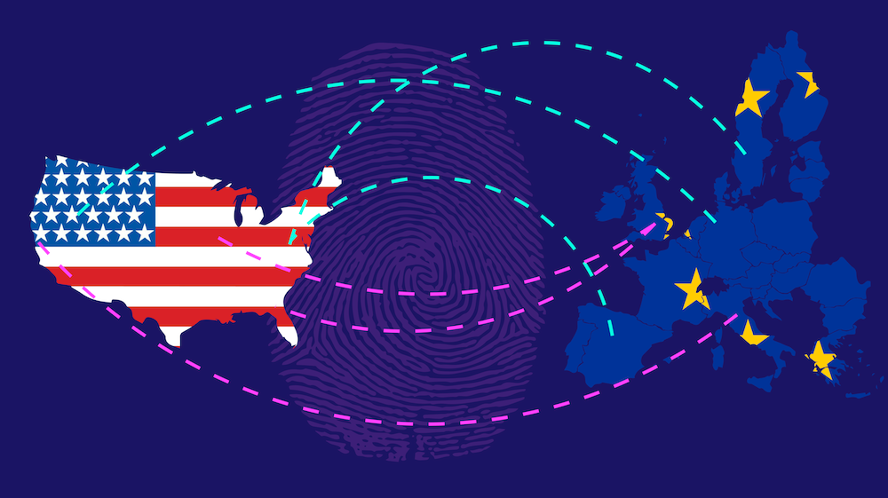

---
summary: ​Safe Harbor framework only applies to international data transfers between the European Union and the US.
locale: en-us
guid: 6cfcd36b-554f-40f5-ae3f-b5030dc4312a
--- 
# Does the Safe Harbor ECJ ruling apply to my OutSystems service

Both OutSystems and AWS respect your choice of AWS Region and **will not move any of your content outside of the AWS Region you chose**.

​Safe Harbor framework only applies to international data transfers between the European Union and the US.  As an OutSystems public cloud customer, you may choose the AWS Region where your infrastructure will be hosted, thus avoiding such international data transfers. 

For example, if you are a European customer, you will normally choose the "EU (Dublin) Region" to host your OutSystems public cloud infrastructure. Therefore, your content will be stored in "EU (Dublin) Region". In this case, Safe Harbor will not apply.

OutSystems will not transfer any content stored in the Dublin infrastructure via the OutSystems public cloud to the US.

## How do you secure personal data?

Neither AWS nor OutSystems are able to distinguish personal data from any other type of data stored by a customer. AWS and OutSystems services are both content agnostic and offer the same level of security regardless of the type of content being stored.

## Do I still need to worry about Safe Harbor?

You may have to worry but not because you are using OutSystems.

OutSystems has no control over how you use the content stored in your infrastructure in the OutSystems public cloud and cannot prevent you from exporting data stored therein to other countries. This means that you may need to review if your data handling processes are still compliant with the relevant legislation following the end of the Safe Harbor framework.

## Where can I learn more about Safe Harbor and AWS?

AWS data privacy FAQ: [https://aws.amazon.com/compliance/data-privacy-faq/](https://aws.amazon.com/compliance/data-privacy-faq/)

EU Data Protection whitepaper: [https://d0.awsstatic.com/whitepapers/compliance/AWS_EU_Data_Protection_Whitepaper_EN.pdf](https://d0.awsstatic.com/whitepapers/compliance/AWS_EU_Data_Protection_Whitepaper_EN.pdf)

