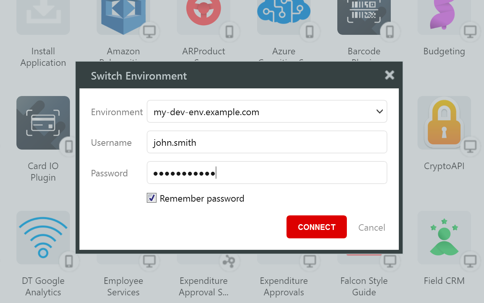
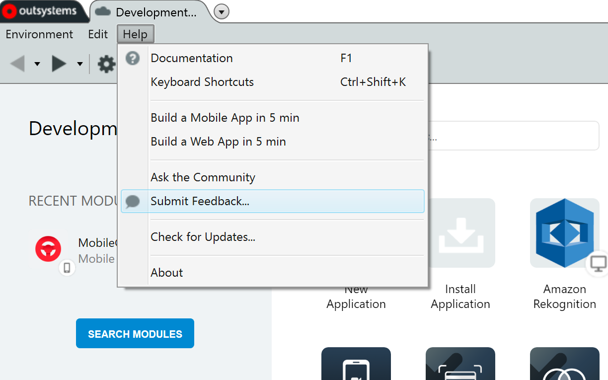
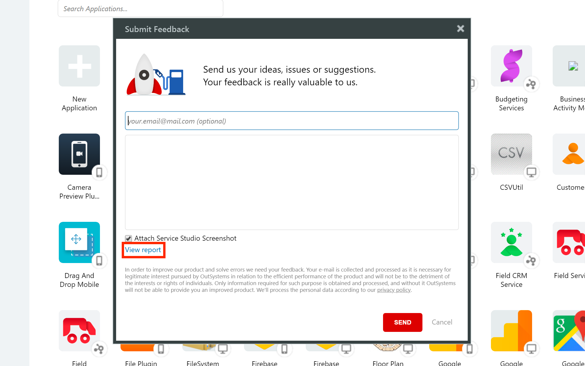
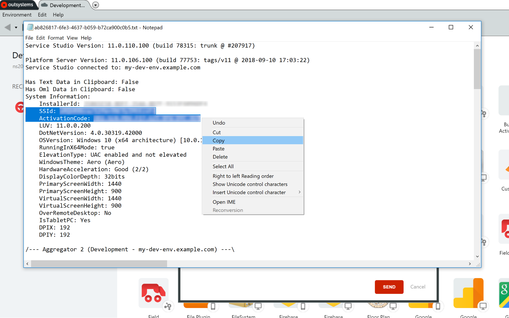

# How to find your SSId and Activation Code

OutSystems uses your SSId and Activation Code to properly identify your development environment. Here is how you can find your SSId and Activation Code.

1. Start your OutSystems 11 Service Studio and connect to the environment you want to use in the program.
    
1. Go to the Help menu and select **Submit Feedback**.
    
1. Click the **View report** link. Your Service Studio report opens in your default text editor (e.g. Notepad).
    
1. Copy the rows with the SSId and Activation Codes from the report.
    
1. Paste the codes into the email you're going to send to us.
