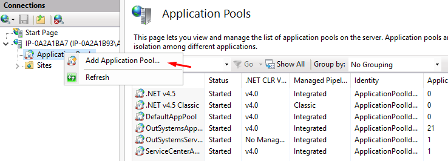
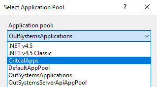

 
# Move an app to another application pool on IIS

This document applies to self-managed OutSystems environments. 

 
By default, all the apps created in Service Studio run on the OutSystemsApplications application pool on IIS.
 
An application pool can have one or more applications that run on a single worker process. A worker process is a windows process (w3wp.exe) responsible for handling requests for a specific application pool. As a separate windows process, each application pool will have its own memory space and can be allocated to separate CPUs for better use of server resources. 
 
Moving apps to another application pool is useful in the following situations:
 
* Isolate critical applications so that they can't be impacted by the resource consumption of other apps.
* Mitigate the impact of misbehaving applications on others apps while you troubleshoot.
 
## Impact
 
This procedure has no impact on applications' availability but once completed, the first request to the app will take longer. Check also the [caveats](#caveats-section) section for impact on SEO Friendly URLs.
 
## Instructions
 
If the environment has more than one front end, the following steps need to be followed on all servers. You can start at any of the front ends.
 
### Create the new application pool and move the applications
 
1. Access the front end server and open IIS Manager.
1. In the connections tab, under the server name, right-click on **Application Pools** and select the option **Add Application Pool**.
 
    

    1. Type a meaningful **Name**.
    1. Set the **.NET CLR version** to '.NET CLR Version v4.0'.
    1. Set the **Managed pipeline mode** to have the same value as the 'OutSystemsApplications' application pool. 
    1. Check the box **Start application pool immediately**.
    1. Click **Ok**.
 
        

1. Right-click on the newly created application pool again and click on the **Recycling...** option:
    1. Uncheck all checkboxes under **Fixed Intervals** group.
    1. Under **Memory Based Maximums**, uncheck **Virtual memory usage (KB)** and as a baseline set the Private memory usage to be 60% of the total physical memory of the machine. Later, you should [fine tune this value](https://www.outsystems.com/goto/application-pool-recycling)  according to performance data collected from the application pool. 
    1. Click **Next**.
    1. Activate all the **Runtime** recycling events. 
 
1. Right-click on the "OutSystemsApplications" application pool and click on the **View Applications** option.
    1. Right-click on the application you wish to send to the new application pool, and press the **Change Application Pool** option.
    1. Select the newly created application pool and press **Ok**.
 
        

### Rollback
 
If you wish to revert these changes and move the isolated applications back to the default 'OutSystemsApplications' application pool, use the following instructions:
 
1. Right-click on the application pool you created and click on the **View Applications** option.
    1. Right-click on each application and press the **Change Application Pool** option.
    1. Select the default 'OutSystemsApplications' application pool and press **Ok**.
 
1. Once the application pool is empty, right-click on the application pool you created and select **Remove**.
 
    
 
## Caveats { #caveats-section }
 
[SEO friendly URLs](https://success.outsystems.com/Support/Enterprise_Customers/Maintenance_and_Operations/OutSystems_Platform_SEO_Friendly_URLs) can only be used for a single application pool. This means that if there are several pools, only the one that has the 'Root Application' defined can execute SEO URL rules.    
