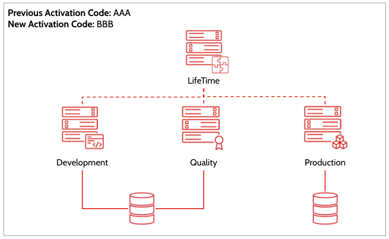
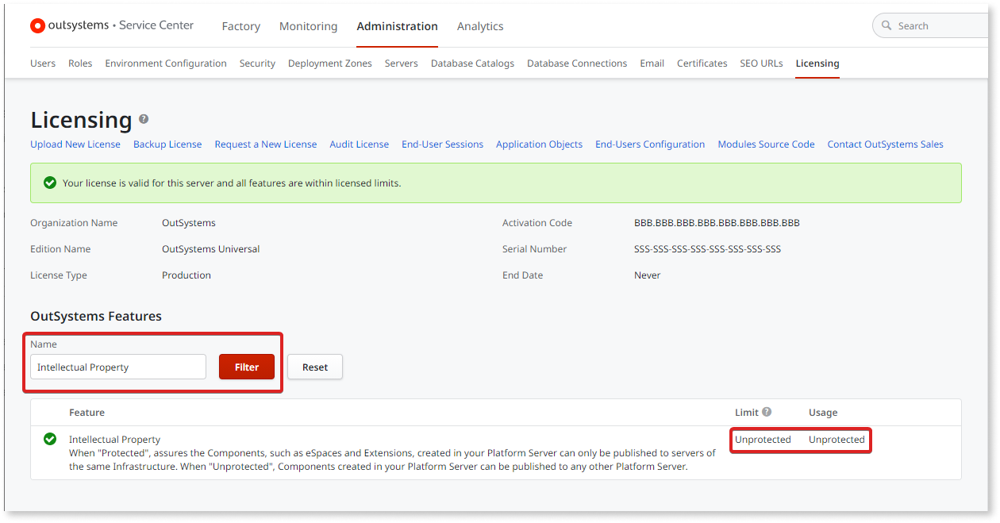
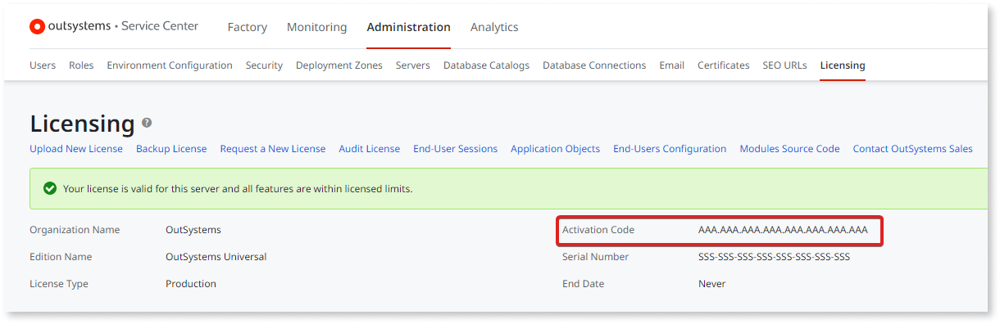

# How to change the Activation Code of your infrastructure

This procedure applies to self-managed environments only.

During the lifecycle of your subscription, you may need to replace the license of one existing infrastructure from an activation code to another. This could be for a number of reasons, including:

* Organization splitting
* Company mergers
* Changes to the license agreement with OutSystems

Changing the Activation Code correctly ensures that downtime is avoided and that your development activities continue normally.

This article covers a scenario where a full infrastructure, including LifeTime, will be moved from a source activation code AAA to a destination activation code BBB. It also covers a [rollback procedure](#rollback) in case of any problems. 

In this scenario, we begin with a single infrastructure with the following environments:

* 1 LifeTime
* 1 Development
* 1 Quality
* 1 Production

This scenario still applies if you have more environments than the ones depicted, as long as the requirements of the following scenario are met:

* You're changing the activation of a full infrastructure, including LifeTime

* All the environments of that infrastructure are registered in LifeTime

**Important** - Do not change your Activation Code if any of the following apply:

* Your infrastructure has environments that are either not registered in LifeTime or are registered in another LifeTime. 
* You don’t want to change the Activation Code of one or more environments controlled by this LifeTime.
* You don’t want to change the Activation Code of the LifeTime environment.

## Changing the Activation Code

Please read the complete procedure before starting to execute it. If you have any questions, please reach out to [OutSystems Support](https://success.outsystems.com/Support) ahead of execution. 

If, while publishing, you get any errors related to Intellectual Property, immediately pause the procedure for the other environments and jump to the [rollback procedure](#rollback).

To move from the previous Activation Code (AAA in this text) to the new Activation Code (BBB in this text), proceed as follows:

1. Pause all deployments to Production. Development activities in other environments may continue.

1. For all environments, backup the license file for the Activation Code AAA.

    a. Go to the [Licensing Portal](https://www.outsystems.com/licensing) and enter your old Production environment Activation Code AAA.

    b. Navigate to the serial number of the Production environment and obtain the license file. Keep the file for backup purposes.

    c. Save the file to disk and rename it to match the name of the environment.

1. You now need to check if you have any modules with intellectual property protection:

    a. Install the OutSystems **ActivationCodeCheck** application.

    * For 010, install [ActivationCodeCheck](../licensing/ipp/files/ActivationCodeCheck-O10.oap)

    * For 011, install [ActivationCodeCheck](../licensing/ipp/files/ActivationCodeCheck-O10.oap)

    b. Open the application and log in with your IT user.

    c. If you see a message saying “IP protected modules present in the factory. Are you executing a license change?”, click **Start Wizard**. If this message isn't displayed, continue with step. 4. 

1. For all environments, register for and obtain the license file for Activation Code BBB from the [Licensing Portal](https://www.outsystems.com/licensing):

    a. Go to [Licensing Portal](https://www.outsystems.com/licensing) and enter your new Activation Code BBB.

    b. Register the serial number of the environment you’re currently working with and obtain the license file.

    c. In Service Center for the relevant environment, navigate to **Administration** > **Licensing**, and choose **Upload New License**. Upload the license file that you requested.

    1. Still on the licensing page, filter for the feature "Intellectual Property".

        

    If it reads **Unprotected** or **Protected**, you are good to go and you can continue to the next environment. 

    If not, your license is not prepared for the migration. Check **FAQ 3** in the [FAQ](#faqs) section.

### Rollback procedure { #rollback }

Please read the complete procedure before starting to execute it. If you have any questions, please reach out to [OutSystems Support](https://success.outsystems.com/Support) ahead of execution. 

To move from the previous Activation Code (AAA in this text) to the new Activation Code (BBB in this text), proceed as follows:

1. Pause all deployments to the Production environment. 
Development activities on the other environments may continue.

1. For all environments that have licenses from Activation Code BBB, restore all license files with those backed up in step 2 above.

    a. In Service Center for each particular environment, go to **Administration** > **Licensing**, and choose **Upload New License**. Upload each environment’s backed up license file.

    b. Confirm that the Activation Code displayed is the old Activation Code AAA.

    

    c. Perform a test republish of a module (e.g. ECT_Provider) in each environment. 

    Go to **Factory** > **Modules** and filter by ECT_Provider. Open the details of the module, locate the version that is currently published and click Publish for that version.

    

1. Contact [OutSystems Support](https://success.outsystems.com/Support) to report the issues and to obtain assistance to move forward.

### FAQs { #faqs }

If something unexpected happens, refer to the [Frequently Asked Questions below](#faqs) or reach out to [OutSystems Support](https://success.outsystems.com/Support), referencing this article and indicating the step at which step something unexpected happened.

1. **I cannot find the serial number of my environment in the old Activation Code**

    Please contact OutSystems Support to obtain a license file in a different way. Before contacting Support, please confirm all environments which do not appear in the old Activation Code (AAA in the script) so you can ask for help for all those environments all at once.
1. **The license I uploaded from the old Activation Code AAA is not prepared for the migration**

    Please contact OutSystems Support to obtain a license file in a different way. Before contacting Support, please finish uploading all licenses to the environments, so you can provide the complete list of environments that do not mention “Intellectual Property: Ignore” so we can help assist for all environments at once.
    
1. **The license I uploaded from the new Activation Code BBB is not prepared for the migration**

    Please contact OutSystems Support so we can correct the license definition at our end. Following that, you will need to repeat the obtaining of the licenses for all environments under Activation Code BBB.
